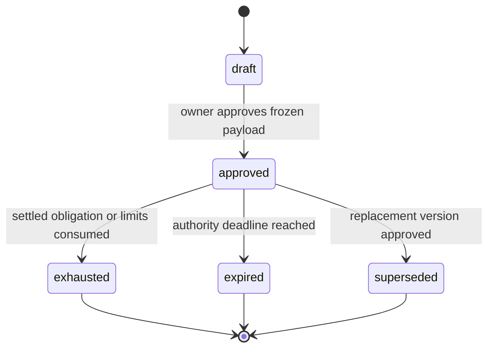
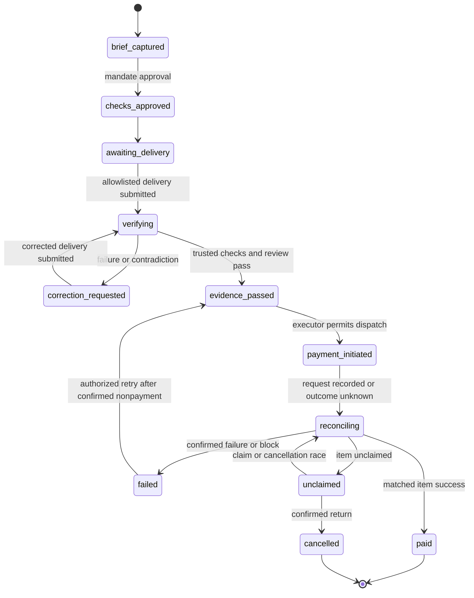
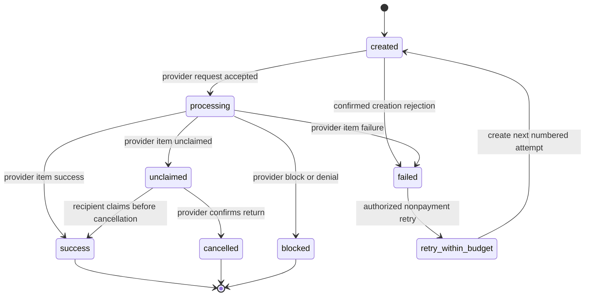

# ProofPay — Project Context

Version: 0.1 | Created: 2 October 2026 | Phase: 0 — context file

## 1. Authority and project status

This file is the single source of truth for later ProofPay phases. Read it before producing each phase. Preserve its requirement IDs. Record changes to approved project decisions in a new document revision; preserve approved payment mandate snapshots separately.

The controlling brief is `Pasted text(20261002-084443).txt`, supplied by the project owner. Where this file elaborates an ambiguous implementation detail, the default is identified below. The project currently has documentation only. No application, deployment, sandbox payout, model evaluation, or agency interview has been completed.

Positioning line — use verbatim:

> ProofPay compiles the review queue between 'work submitted' and 'payment released' into executable acceptance checks — and pays only when evidence passes.

Target: PayPal AI Hackathon. Submit before **13 November 2026, 03:30 IST** (`2026-11-12T22:00:00Z`). Internal submission target: 12 November, 18:00 IST. Judge access must continue through the judging deadline, 15 December 2026, 08:00 Pacific (`2026-12-15T16:00:00Z`); operational access target is through 16 December, 00:00 UTC. These are required availability dates, not an uptime claim. [S01]

Team assumption: 1–3 builders, led by a backend/DevOps engineer, working part-time for about six weeks.

## 2. Audience, problem, and value

The target segment is small US software agencies paying existing freelance contractors through PayPal. The problem hypothesis is that delivery review delays payment and consumes agency-owner time. Validate it with three agency-owner interviews and measured review sessions. Do not invent market size, review-time savings, willingness to pay, or customer quotations.

| Persona | Decision or task | Product surface |
| --- | --- | --- |
| Agency owner | Define acceptance criteria, approve conditional payment authority, and resolve uncertain evidence | Work Queue, Brief Composer, Mandate Approval, Evidence Review, Receipt |
| Contractor | Submit a known fixture version, understand corrections, and inspect payment status | Contractor Portal |
| Judge | Exercise broken delivery, correction, payout, receipt, and replay without supplying personal API keys | Judge Workspace with seeded agency-owner and contractor roles |

The product connects brief interpretation, executable checks, evidence review, correction, and payment reconciliation. AI initiates an approved payment request. The backend executor controls whether that request reaches PayPal.

## 3. Scope fence and feature admission

The MVP contains exactly one agency workspace, one fixture application, two contractor sandbox recipient references, USD payouts, three acceptance checks per approved brief, and three supported brief families: responsive CSS, API endpoint repair, and keyboard accessibility.

The fixture has allowlisted broken and corrected artifact versions. A delivery selects one of those versions. Arbitrary repositories, uploaded executable archives, user-defined runner code, additional fixture applications, and additional recipients are outside the MVP.

| Supported brief | Example intent | Three executable check templates |
| --- | --- | --- |
| Responsive CSS | Fix checkout at 320px; preserve its total; keep checkout keyboard accessible | `viewport_no_horizontal_overflow`, `cart_total_unchanged`, `keyboard_checkout_reachable` |
| API endpoint repair | Repair cart totals: return HTTP 200, a valid response schema, and the correct total | `api_status`, `api_schema`, `api_total_matches_fixture` |
| Keyboard accessibility | Make checkout reachable and activatable by keyboard, with an accessible control name | `keyboard_checkout_reachable`, `keyboard_activation`, `accessible_control_name` |

The compiler selects trusted templates and binds parameters from the brief and fixture registry. It cannot generate executable runner code. Expected totals and baseline facts come from the trusted fixture manifest. The three check sets must differ materially; changing check IDs alone does not demonstrate compilation.

Admit a feature only when its requirement maps to a judging criterion or demo beat in section 11. Add every other proposed feature to the Parking Lot. Cutting multi-brief generality means cutting arbitrary generalization and extra UI options; preserve the three fixed evaluation briefs required by this scope fence.

## 4. Architectural invariants

| Invariant | Binding rule | Requirement references |
| --- | --- | --- |
| I1 — credential custody | AI, browser clients, fixture application, and runner receive no PayPal credentials. The backend payment-executor component alone calls PayPal APIs, including OAuth, status, signature verification, and cancellation. | NFR-01, FR-10 |
| I2 — approved mandate immutability | Approval freezes recipient reference, amount, currency, checks, expiry, budget, attempt limit, and release authority. Changes create a new version. Delivery corrections preserve the existing version. | FR-03, NFR-05 |
| I3 — idempotent execution | One payment obligation exists per milestone across mandate versions. Replays resolve to its existing attempt. HTTP retries reuse that attempt's stable `sender_batch_id`. | FR-14, NFR-02 |
| I4 — truthful payment states | Keep processing, unclaimed, failed, paid, and cancelled distinct. Cancel an eligible unclaimed item and return its principal to the app budget only after provider-confirmed cancellation/return. | FR-11, FR-12, NFR-03 |
| I5 — trusted verification | Run approved templates in an isolated Playwright container, bound to the delivered artifact version. AI cannot run unvetted code, alter runner results, or create evidence artifacts. | FR-05, FR-06, NFR-04 |
| I6 — grounded decisions | Every AI per-check verdict cites existing evidence references. Uncertainty requires human review; a reviewer cannot override a failed executable acceptance check. | FR-07, FR-09 |
| I7 — sandbox boundaries | Use funded sandbox accounts and simulated business data. App budget reservations are controls, not escrow or a payment guarantee. | FR-01, NFR-01, NFR-03 |
| I8 — scope enforcement | Enforce the one-fixture, two-recipient, USD, three-check, three-brief-family boundary. Reject unsupported requests explicitly. | FR-01, FR-02 |

Approved payloads remain immutable. Lifecycle status is a projection of append-only events. Updating that projection does not edit an approved snapshot. A superseded or expired mandate blocks new payout initiation; an already initiated payment continues to reconcile.

## 5. Fixed stack and component boundaries

| Component | Fixed technology | Responsibility and access |
| --- | --- | --- |
| Frontend | React + TypeScript, shadcn/ui, AG Grid | Work Queue and role-specific screens; calls app APIs; holds no provider secrets |
| API | FastAPI | Role checks, briefs, mandates, deliveries, evidence retrieval, corrections, judge sessions, receipts, and webhook ingress |
| Storage | PostgreSQL | Mandate snapshots, fixture references, small evidence artifacts, decisions, budgets, attempts, outbox, webhook records, and audit events |
| Outbox worker | Python + PostgreSQL outbox | Durable workflow orchestration; delegates all PayPal operations to the backend executor |
| Payment executor | Backend-only Python module | Token caching, permitted PayPal calls, immutable request binding, idempotency, and reconciliation |
| Trusted runner | Playwright in isolated Docker container | Execute allowlisted fixture checks and persist attributable screenshots/results; no PayPal or model credentials |
| AI adapter | LLM with structured tool calls and image input | Compile checks and assess grounded evidence; return concise user-visible rationale and validated references |
| Local runtime | Docker Compose | API, worker, runner, fixture application, and PostgreSQL |
| Hosted runtime | Render | Separate Docker-based services/workers and durable PostgreSQL; judge URL remains usable through judging |

Keep a backend-only `recipient_ref → confirmed sandbox receiver` mapping. `email_hash` is an audit comparison value, not a PayPal receiver address. Pin the resolved receiver in the approved mandate's protected binding so a later directory edit cannot redirect payment.

Evidence includes artifact digest/version, mandate-version digest, check ID, run ID, timestamps, screenshot reference where applicable, and structured result reference. Store screenshot bytes durably with PostgreSQL for this small MVP. Validate references and access permissions before sending evidence to the model.

For Render, deploy the runner image as a separate worker that polls verification jobs. Do not assume a worker can start nested Docker containers or accept inbound HTTP. Validate private fixture access and screenshot persistence during the Day 1 infrastructure spike. Docker-based deploys and polling background workers are documented capabilities. [S10, S11]

## 6. PayPal boundary — six endpoints only

Use `https://api-m.sandbox.paypal.com` as the configured PayPal API base. Reject live mode. Set up and fund accounts, obtain credentials, and configure webhook subscriptions through the Developer Dashboard; add no PayPal API endpoints beyond this table.

| Purpose | Method and path | Executor behavior |
| --- | --- | --- |
| Authentication | `POST /v1/oauth2/token` | Cache access tokens with expiry safety margin; redact credentials and tokens |
| Create payout | `POST /v1/payments/payouts` | Bind receiver, USD amount, sender IDs, and approved obligation; persist request identity before dispatch |
| Batch status | `GET /v1/payments/payouts/{batch_id}` | Discover items and inspect aggregate processing; batch success alone cannot mark a task paid |
| Item status | `GET /v1/payments/payouts-item/{item_id}` | Reconcile recipient-level status and returned identifiers/amounts |
| Verify webhook | `POST /v1/notifications/verify-webhook-signature` | Verify genuine transaction events before allowing them to affect financial state |
| Cancel unclaimed | `POST /v1/payments/payouts-item/{item_id}/cancel` | Re-check unclaimed eligibility; record the request; reconcile the confirmed outcome |

These operations are documented in the PayPal Payouts and webhook references. [S02, S04, S05]

Subscribe through the dashboard to relevant payout events, including `PAYMENT.PAYOUTS-ITEM.SUCCEEDED` and `PAYMENT.PAYOUTS-ITEM.UNCLAIMED`. Batch notifications lack item information; obtain item details through the allowed GET operations. For the main demo, use webhook events from actual sandbox transactions. Mock simulator events are not financial evidence and have different signature-verification constraints. [S03, S04]

### 6.1 Retry, reservation, and status rules

A network timeout, HTTP retry, or repeated event does not create a new financial attempt. Persist the attempt and its stable sender IDs before dispatch. If the result is unknown, retain the reservation and reconcile; never create another attempt to discover what happened.

A confirmed non-payment failure may permit a separately numbered business attempt under the same obligation, subject to the approved maximum of three attempts. A new business attempt has a new persisted batch ID; retransmission of any existing attempt reuses its original ID. Preserve failed item records. Allow at most one unresolved attempt and one successful payment per obligation across mandate versions. PayPal's duplicate-batch protection is time-bounded; application uniqueness survives judge resets and that window. [S02, S07]

Default pending Q2: `budget.max_total` caps payout principal, not fees. Reserve principal before dispatch. On success, consume it; on confirmed non-payment failure, release it; on processing or unclaimed status, retain it; on confirmed return, release it once. Record provider fees separately and fund fee headroom in the sandbox account. This default does not promise a fee-inclusive hard cap.

| Provider item status | Canonical app interpretation | Budget action |
| --- | --- | --- |
| `SUCCESS` | PayoutItem `success`; DeliveryTask and receipt `paid` | Consume principal reservation once |
| `PENDING` or `ONHOLD` | `processing`; attach a review flag for a hold | Retain reservation |
| `UNCLAIMED` | `unclaimed`; run the eligible cancellation workflow | Retain until confirmed return |
| `FAILED` | `failed`; classify whether another business attempt is permitted | Release only after non-payment is established |
| `BLOCKED` or `DENIED` | PayoutItem `blocked`; task `failed` with provider reason and manual-review flag | Establish the financial outcome before release; no automatic retry |
| `RETURNED` | `cancelled` with explicit return reason | Release returned principal once |
| Unrecognized status or external refund | Preserve raw status and raise reconciliation review | No inferred payment, cancellation, or reserve release |

Confirm the raw cancellation response and fee behavior during the sandbox spike. Cancellation is permitted only for an unclaimed item. A cancellation request or HTTP acknowledgement alone cannot release the reservation. If the recipient claims concurrently, refresh status and report the actual outcome. [S05, S06]

## 7. Initial mandate snapshot

This example elaborates the supplied skeleton. Its identifiers and timestamps are illustrative; they do not represent an actual approval. Seed scripts generate fresh identifiers, approval timestamps, and expiry values.

```json
{
  "mandate_id": "mandate_demo_001",
  "version": 1,
  "status": "approved",
  "payer": {"account_ref": "payer_sandbox_us"},
  "payee": {
    "recipient_ref": "contractor_maya",
    "display_name": "Maya (sandbox)",
    "email_hash": "<hash-of-confirmed-sandbox-email>"
  },
  "amount": {"currency": "USD", "value": "75.00"},
  "budget": {"max_total": "75.00", "max_attempts": 3},
  "authority": {
    "type": "conditional_release",
    "condition": "all checks pass",
    "expires_at": "2026-10-03T09:00:00Z"
  },
  "acceptance_checks": [
    {
      "check_id": "C01",
      "type": "viewport_no_horizontal_overflow",
      "params": {"width": 320, "target_ref": "checkout"},
      "compiled_by": "ai",
      "approved": true
    },
    {
      "check_id": "C02",
      "type": "cart_total_unchanged",
      "params": {"baseline_ref": "fixture_cart_v1"},
      "compiled_by": "ai",
      "approved": true
    },
    {
      "check_id": "C03",
      "type": "keyboard_checkout_reachable",
      "params": {"control_ref": "checkout_pay"},
      "compiled_by": "ai",
      "approved": true
    }
  ],
  "audit": {
    "approved_by": "agency_owner_demo",
    "approved_at": "2026-10-02T09:00:00Z",
    "immutable": true
  }
}
```

Use decimal strings or integer cents for money. Approval requires exactly three valid, distinct checks; USD; an allowlisted recipient; an amount within the principal cap; an unexpired authority; and recorded approver identity. Maximum attempts counts business initiation attempts, including the first; transport retries do not consume it. Status in the stored approval snapshot remains its approval-time value; current lifecycle status comes from events.

## 8. AI tool contracts

| Backend-exposed tool | Input | Required output and boundary |
| --- | --- | --- |
| `propose_checks` | `brief` plus authorized fixture context | `{checks[], ambiguities[], clarifying_questions[]}`; approval-ready output contains exactly three allowlisted templates with validated parameters |
| `inspect_evidence` | `evidence_bundle` resolved by the backend | `{verdict: pass\|fail\|uncertain, per_check_results[], contradictions[], rationale, evidence_refs[]}`; every per-check assessment cites existing attributable evidence |
| `request_correction` | `task_id, findings` | `{contractor_message}`; persist an internal portal message with evidence references; do not send external email or messages |
| `request_payout` | `mandate_id, task_id, evidence_refs` | `decision_request`; records a recommendation only; the executor independently validates approved authority and payment state before dispatch |

The backend rejects nonexistent evidence references, stale artifact versions, references from another task, and output that contradicts trusted failed checks. Submitted notes are untrusted task data. They cannot change tool permissions or instruct the runner or payment executor.

An uncertain AI verdict retains a hold and creates a human-review flag. The owner may record a grounded resolution of ambiguity when all executable checks pass. The owner cannot waive an executable failure; change the delivery or approve a new mandate version. Preserve the original uncertain verdict and subsequent review event.

## 9. State machines and transition guards

These are canonical app states. Preserve raw PayPal states separately. Holds for uncertainty, expiry, or missing evidence are reason flags on the existing workflow; they do not invent provider financial states.

### 9.1 Mandate



Approval of a replacement version blocks new initiation under the prior version. It does not cancel an existing provider payment or reset the obligation's payment history. Expiry blocks new initiation; it does not erase an already initiated transaction.

### 9.2 DeliveryTask



Uncertainty stays in `verifying` with `review_required=true`; dispatch is disabled. `evidence_passed` can remain held if authority, expiry, budget, or retry checks fail. A retry requires still-valid artifact-bound evidence and mandate authority. A superseded mandate cannot initiate that retry.

### 9.3 PayoutItem



`retry_within_budget` describes the obligation's retry orchestration. The failed provider item remains immutable; the next attempt gets its own item record. `created` may initially have no provider item ID; batch inspection resolves it. Duplicate events, unknown outcomes, unclaimed items, or blocked items cannot spawn a new attempt.

## 10. Demo beats — 175 seconds

The primary arc uses the responsive-CSS brief and a $75 contractor payout. The API and accessibility briefs demonstrate compiler breadth through the evaluation harness and judge workspace.

| Beat | Time | Required visible evidence |
| --- | --- | --- |
| D01 | 0–10s | Agency review queue and audience-specific problem |
| D02 | 10–25s | Brief entered with known contractor and bounded amount |
| D03 | 25–42s | AI proposes three acceptance checks from that brief |
| D04 | 42–53s | Owner approves immutable mandate and conditional authority |
| D05 | 53–72s | Broken delivery selected; trusted verification executes |
| D06 | 72–89s | Claim says fixed; screenshot shows horizontal overflow at 320px; held state and cited contradiction |
| D07 | 89–109s | Contractor resubmits corrected artifact; existing mandate continues |
| D08 | 109–125s | Passed checks, grounded review, and executor guard results |
| D09 | 125–143s | Actual sandbox payout creation and returned batch ID |
| D10 | 143–161s | Actual item success and receipt linking brief, evidence, decision, and transaction |
| D11 | 161–169s | Replayed delivery resolves to existing attempt; dedup feedback |
| D12 | 169–175s | Agency and contractor views show the same financial outcome |

The video ends at 2:55. Compress genuine waiting with a visible elapsed-time label; preserve actual outputs and state order. Display processing until item success is verified. Never use invented successful payment identifiers or model outputs as evidence of an executed main demo.

## 11. Foundational requirements and traceability

MoSCoW values are Must, Should, Could, and Won't for MVP. All rows below are foundational requirements; later documents refine them without renumbering. Judging abbreviations: T = Technological Implementation, D = Design, I = Potential Impact, N = Innovation, P = Presentation. Each criterion is equally weighted. [S01]

### 11.1 Persona stories

| ID | Priority | Story | Given / When / Then acceptance criteria | Judging | Demo |
| --- | --- | --- | --- | --- | --- |
| US-01 | Must | Owner approves a bounded delivery-to-payment workflow | Given a supported brief and recipient, when the owner approves the checks and authority, then verified delivery can request payment under that frozen mandate. | T, D, I | D02–D10 |
| US-02 | Must | Contractor understands and corrects rejected delivery | Given failed artifact-bound evidence, when the contractor opens the correction and resubmits a corrected version, then verification resumes without changing approved criteria. | D, I | D06–D07 |
| US-03 | Must | Judge exercises a complete, truthful sandbox journey | Given a seeded workspace, when the judge follows the broken/corrected/replay path, then actual evidence, item status, receipt, and dedup behavior are inspectable. | T, D, P | D01–D12 |

### 11.2 Functional requirements

| ID | Priority | Requirement | Given / When / Then acceptance criteria | Judging | Demo |
| --- | --- | --- | --- | --- | --- |
| FR-01 | Must | Enforce the fixed MVP scope | Given an unsupported fixture, third recipient, non-USD amount, or unsupported brief family, when submitted, then reject it with a specific explanation and create no payment. | T, D | D02, D08 |
| FR-02 | Must | Compile exactly three approved checks | Given the three supported briefs, when compiled with ambiguities resolved, then each produces exactly three valid checks and the sets differ materially. | T, N | D03 |
| FR-03 | Must | Approve immutable mandate versions | Given a valid draft, when approved, then its financial and check payload freezes; any later edit requires a new version. | T, D | D04 |
| FR-04 | Must | Enforce conditional release authority | Given a payout recommendation, when any release guard fails, then dispatch is held with the failed guard recorded. | T | D06, D08 |
| FR-05 | Must | Bind delivery to a known artifact version | Given an allowlisted artifact version, when delivered, then record its digest and bind every verification result to that version. | T | D05, D07 |
| FR-06 | Must | Produce trusted executable evidence | Given approved check parameters, when the runner executes them, then persist attributable results and applicable screenshots without modifying criteria. | T, P | D05–D08 |
| FR-07 | Must | Ground the AI review in existing evidence | Given the contradictory broken delivery, when reviewed, then return failure and cite the claim, failed result, and 320px screenshot references. | T, N, P | D06 |
| FR-08 | Must | Request correction and resume delivery review | Given a held delivery, when a corrected artifact arrives, then retain its predecessor, issue a new run, and preserve the approved mandate. | D, I | D06–D07 |
| FR-09 | Must | Route uncertainty to human review | Given an uncertain verdict, when returned, then hold release; an authorized grounded resolution remains auditable and cannot override an executable failure. | T, D | D06, D08 |
| FR-10 | Must | Initiate payouts only through the executor | Given passing evidence and valid authority, when release is requested, then the executor sends the bound sandbox payout and persists provider references. | T | D08–D09 |
| FR-11 | Must | Reconcile recipient-level payment status | Given accepted creation or a verified webhook, when reconciled, then inspect the matched item and show its actual state; batch success alone never means paid. | T, P | D09–D10 |
| FR-12 | Must | Cancel and reconcile an eligible unclaimed item | Given a confirmed unclaimed item, when cancellation is requested, then resolve the actual provider outcome and release budget only on confirmed return. | T | D10 |
| FR-13 | Must | Present a linked receipt | Given a reconciled item, when either permitted role opens its receipt, then brief, approved mandate, artifact evidence, decision, amount, fees, and provider IDs are traceable. | T, D, P | D10, D12 |
| FR-14 | Must | Resolve duplicate and retry events safely | Given a replay or unknown-outcome transport retry, when processed, then reuse the existing attempt and sender IDs without a second financial initiation. | T, P | D11 |
| FR-15 | Must | Provide the specified owner and contractor surfaces | Given a role and task, when opened, then show its permitted AG Grid queue, approval/evidence screens, or contractor submit/correction/status view. | D, P | D01, D04, D06, D12 |
| FR-16 | Must | Seed and reset a judge workspace safely | Given a reset with unresolved payments, when requested, then defer it; once safe, create a fresh run namespace and retain historical payment/dedup records. | T, D, P | D01, D11 |

### 11.3 Nonfunctional and validation requirements

| ID | Priority | Requirement | Given / When / Then acceptance criteria | Judging | Demo |
| --- | --- | --- | --- | --- | --- |
| NFR-01 | Must | Enforce sandbox mode and secret custody | Given a browser, model, runner, or fixture request, when inspected, then no PayPal secrets are present; live mode is rejected. | T | D08–D10 |
| NFR-02 | Must | Preserve durable idempotency | Given concurrent dispatch, worker restart, or delayed replay across resets, when processed, then one obligation has at most one unresolved attempt and one successful payment. | T | D09, D11 |
| NFR-03 | Must | Preserve accurate budget accounting | Given any attempt state change, when posted, then principal is reserved, consumed, or released once according to confirmed outcome; pending/unclaimed funds remain reserved. | T | D08–D10 |
| NFR-04 | Must | Isolate the runner | Given an unapproved artifact, executable code, target URL, or template, when requested, then reject it; allowlisted execution has no provider credentials. | T | D05–D08 |
| NFR-05 | Must | Preserve attributable audit records | Given approval, review, supersession, payment, or reset, when recorded, then append actor, correlation ID, timestamp, and relevant digests without rewriting prior evidence. | T, D | D04, D06, D10–D11 |
| NFR-06 | Must | Enforce role and workspace boundaries | Given a contractor requesting another contractor's data or owner-only approval/reset, when authorized, then deny access; judges use assigned demo roles. | T, D | D04, D12 |
| NFR-07 | Should | Meet proposed latency targets | Given a warm fixture and 30 measured runs, when benchmarked, then target p95 local command acknowledgement <=1s and runner execution <=30s; report model/provider waiting separately. | D, P | D03, D05–D10 |
| NFR-08 | Must | Keep the hosted demo usable through judging | Given a judge visit before the access deadline, when using supplied instructions, then fixtures, evidence, credentials, database, and provider state are available. | D, P | D01–D12 |
| NFR-09 | Must | Validate the problem with real observations | Given three agency-owner interviews and review-time observations, when summarized, then report actual findings and baseline measurements without fabricated savings. | I | D01 |

Phase 0 validates documentation consistency only. Product acceptance tests, benchmarks, interviews, and provider integration checks remain future exit gates.

## 12. Competition, prize fit, and red-team review

The differentiator is the acceptance-check compiler plus the complete agency-to-contractor workflow. The concept is portable. PayPal is central because the selected workflow initiates and reconciles contractor payments through PayPal Payouts; do not claim provider exclusivity.

| Competitor | Documented overlap | Product hypothesis to validate |
| --- | --- | --- |
| Upwork | Milestone funding, submission, client review, and payment release [S12] | Agencies want executable acceptance checks for existing contractor relationships |
| Payman AI | Agent authorization, spend limits, approved payees, and auditability [S13] | Domain-specific delivery assessment adds value beyond spend permission |
| Paybond | Agreement/evidence evaluation and settlement/review trails [S14] | Compiling software briefs into executable checks and presenting correction/payment as one product is a useful focused wedge |

Target Best Use of Agentic Commerce ($5,000), Best Use of PayPal + AI ($5,000), and Best Demo Delivery ($5,000). AG Grid's queue filtering, status inspection, and row detail support Design and its $5,000/$2,000/$1,000 tiers. Render hosts the functioning product and supports its credits awards. These are award targets, not expected wins or a promise that prizes stack. APIMatic is optional and belongs in the Parking Lot unless actually integrated. [S01]

| Judging criterion | Skeptical review | Required response before submission | Requirement references |
| --- | --- | --- | --- |
| Technological Implementation | Is this a scripted payment attached to a model summary? | Real tool outputs, artifact-bound runner evidence, executor guards, provider item reconciliation, and replay safety | FR-02, FR-06–FR-07, FR-10–FR-14, NFR-02 |
| Design | Can both parties understand why money is held or paid? | Role-specific screens with clear state, evidence, correction, and receipt | US-01–US-03, FR-08, FR-13, FR-15 |
| Potential Impact | Does the review queue matter to this audience? | Three interviews and observed review times; label unvalidated claims | NFR-09 |
| Innovation | How is this different from Paybond or a fixed CI trigger? | Three materially different compiled check sets and a focused agency delivery workflow | FR-02, FR-07–FR-08 |
| Presentation | Are the contradiction and payment outcome visible in 175 seconds? | A real broken/corrected run with cited evidence, true item status, receipt, and dedup | US-03, FR-07, FR-11, FR-13–FR-14 |

## 13. Six-week plan and exit gates

| Week | Dates, 2026 | Work and owner focus | Exit gate |
| --- | --- | --- | --- |
| 1 | 2–8 Oct | Lead: funded US sandbox sender, two recipients, a $1 payout spike, webhook/cancel investigation, Render runner proof; team: interviews and approved brief examples | Genuine item success recorded; executor-only credentials verified; unresolved cancellation behavior logged; hosted runner can persist screenshot evidence |
| 2 | 9–15 Oct | Backend/data: immutable approval, artifact registry, budget ledger, outbox, role boundaries; AI: compiler and three brief fixtures | Three distinct supported briefs compile into three valid checks each; invalid scope and unauthorized approval are rejected |
| 3 | 16–22 Oct | Verification: broken/corrected runner outputs, evidence storage, AI contradiction review, correction/resumption, uncertainty hold | Broken mobile version produces the exact 320px contradiction; corrected version passes under the same mandate |
| 4 | 23–29 Oct | Payments: executor, durable IDs, verified webhooks, item reconciliation, retry classification, eligible unclaimed recovery | A restart/replay cannot duplicate initiation; actual states and reservations agree; recovery cases have documented sandbox evidence |
| 5 | 30 Oct–5 Nov | Product: AG Grid queue, approval/evidence/receipt views, contractor portal, judge roles, hosted integration | A judge follows the complete journey without personal keys; access controls and both seeded cases are usable |
| 6 | 6–12 Nov | Team: failure matrix, reset runbook, benchmark/interview findings, public licensed repo, 175-second recording, Devpost submission | Required tests pass; truthful demo rehearsed; repo/video visibility and access-through-judging checked; submit by internal target |

Stage gates can overlap; none can be claimed complete without evidence. If the schedule slips, cut arbitrary generalization, optional UI polish, and sponsor integrations first. Preserve the contradiction, actual payout/item reconciliation, and dedup story; retain the three fixed compiler evaluation briefs.

Day 1 go/no-go spike is required because the lead is based in India. Test developer access with a US sandbox business sender rather than asserting live Indian sending capability. PayPal documents sandbox testing while live Payouts access is under review and country-specific capabilities; India is listed for receiving and withdrawing. A failed spike triggers diagnosis and a documented decision. The Disputes-based pivot is a contingency requiring a revised source of truth; it is not permission to add Disputes APIs to this MVP. [S08, S09]

## 14. Judge workspace and delivery constraints

Seed one approved mandate ready for broken delivery and one completed case backed by a genuine prior sandbox run. A completed seed must reference actual PayPal identifiers and actual recorded runner/model outputs. Label illustrative schema examples and capability simulations separately from executed cases.

Reset creates a fresh `demo_run_id` and fresh identifiers. It preserves payment attempts, webhook dedup keys, provider references, and audit history. It neither deletes PayPal transactions nor refills the sandbox wallet. Defer reset while money movement is unresolved; document manual sandbox funding maintenance.

The local target is one start command after credentials are configured: `docker compose up --build`. The final README may use up to three setup commands. The hosted judge URL is the preferred route and uses server-held sandbox/model credentials. Provide demo role access instructions without exposing provider secrets.

Submission assets are the functional hosted URL or reproducible setup, public GitHub source and assets, root MIT license, English description and tools list, and a publicly visible YouTube video under three minutes. Treat a public video as the required setting; do not silently substitute unlisted. Keep the hosted workspace available through judging. [S01]

| Phase | Required artifacts | Status after this phase |
| --- | --- | --- |
| 0 | `docs/00-PROJECT_CONTEXT.md` | Context document completed; product not implemented |
| 1 | `docs/01-BRD.md`, `docs/02-PRD.md` | Planned |
| 2 | `docs/03-SYSTEM_DESIGN.md`, `docs/04-API_SPEC.yaml`, `docs/05-DATA_MODEL.md`, `docs/06-AI_LAYER.md` | Planned |
| 3 | `docs/07-BACKEND_PLAN.md` plus actual backend/runner/Compose scaffold | Planned |
| 4 | `docs/08-UI_SPEC.md` plus Work Queue, Evidence Review, and Receipt component code | Planned |
| 5 | `docs/09-TEST_PLAN.md`, `docs/10-DEMO_AND_SUBMISSION.md` plus submission pack | Planned |

Later API specifications use OpenAPI 3.1 YAML. All diagrams use Mermaid. Each document ends with Assumptions and Open Questions. Each phase receives a five-criterion red-team review and stops at its own gate. Continue only after the project owner replies CONTINUE.

## 15. Parking Lot

| Candidate outside MVP | Reason excluded | Condition for reconsideration |
| --- | --- | --- |
| Arbitrary repositories, generated test code, or more fixture apps | Breaks trusted-runner and scope boundaries | New isolation model and explicit scope revision |
| More recipients, currencies, agencies, or live payments | Expands financial and authorization scope | Revised mandate/account model and separate launch decision |
| Escrow, payment guarantees, and bank-balance integration | Unsupported by the chosen six-endpoint workflow | Separate product, authorization, and integration decisions |
| Full hiring, legal-contract negotiation, or reputation marketplace | Does not serve a required demo beat | Validated agency demand after the MVP |
| Generic agent SDK and additional sponsor tools | Dilutes the acceptance-check differentiation | Concrete judged benefit and sufficient time |
| Disputes-based fallback | Changes core product and allowed PayPal APIs | Go/no-go decision followed by a revised project context |

## 16. Sources and evidence policy

Official sources checked on 2 October 2026. These establish platform capabilities and rules; they do not establish that ProofPay has executed them. Record actual spike, evaluation, interview, and deployment evidence in later phases. Competitor gaps are hypotheses, not verified absence claims.

| Ref | Source |
| --- | --- |
| S01 | [Hackathon official rules](https://paypalaihackathon.devpost.com/rules) and [overview](https://paypalaihackathon.devpost.com/) |
| S02 | [PayPal Payouts API guide](https://developer.paypal.com/api/payouts/) and [Payouts endpoint reference](https://developer.paypal.com/api/payments.payouts-batch/v1/) |
| S03 | [Payouts webhook event names](https://developer.paypal.com/payouts/webhooks/) |
| S04 | [Webhook integration and signature verification](https://developer.paypal.com/api/rest/webhooks/rest/) |
| S05 | [Cancel an unclaimed payout item](https://developer.paypal.com/api/payments.payouts-batch/v1/payouts-item-cancel) |
| S06 | [Payout payment processing and statuses](https://developer.paypal.com/payouts/payment-processing/) |
| S07 | [Payout customization and duplicate batch IDs](https://developer.paypal.com/docs/payouts/standard/integrate-api/customize/) |
| S08 | [Payouts access and sandbox testing](https://developer.paypal.com/payouts/use-payouts/overview) |
| S09 | [Country capabilities](https://developer.paypal.com/payouts/supported-features/) |
| S10 | [Docker on Render](https://render.com/docs/docker) |
| S11 | [Render background workers](https://render.com/docs/background-workers) |
| S12 | [Upwork fixed-price review and payment](https://support.upwork.com/hc/en-us/articles/17974824831507--Review-and-pay-for-fixed-price-contracts-and-milestones) |
| S13 | [Payman authorization and spend controls](https://paymanai.com/events/ai-volution-trust-ai-money) |
| S14 | [Paybond agreement and evidence evaluation](https://paybond.ai/harbor) |

## 17. Assumptions

| ID | Assumption or adopted default | Validation and consequence |
| --- | --- | --- |
| A01 | Team has 1–3 builders and roughly six weeks part-time | Confirm Q3; redistribute work or cut optional generalization |
| A02 | The lead can use a funded US sender and two recipient sandbox references from their developer account | Day 1 payout spike; diagnose access failures before building the full product |
| A03 | Real sandbox webhook delivery and an eligible unclaimed-cancellation scenario can be exercised | Verify the actual flow/test setup; keep unproven recovery paths explicitly marked until checked |
| A04 | The configured LLM supports structured tools and image input | Select Q1 provider; validate schema adherence, grounding, and latency before the primary demo |
| A05 | Principal-only `max_total`; fees recorded separately; maximum three business initiation attempts | Confirm Q2; changing budget meaning requires a context revision before implementation |
| A06 | Approved payloads are immutable; lifecycle projections and new mandate versions remain possible | Preserve snapshots and append events; enforce uniqueness across versions |
| A07 | Fixture baselines, artifact versions, runner templates, and recipient bindings are trusted and allowlisted | Registry and role checks must prevent contractor/model mutation |
| A08 | A separate Render runner worker can reach fixtures and persist evidence without a nested Docker daemon | Infrastructure spike; keep Compose reproducibility and revise hosting details if needed |
| A09 | Agency review queues create measurable cost or payment delay | Three interviews and review-time observations; revise impact claims if evidence disagrees |
| A10 | Latency values are proposed targets; no performance or customer evidence exists yet | Benchmark and report actual results; show real provider/model waiting |

## 18. Open Questions

These questions do not block Phase 0. Stated defaults remain the basis for subsequent documentation unless the owner changes them.

| ID | Question for the project owner | Current default and needed decision |
| --- | --- | --- |
| Q1 | Which LLM provider/model and API access should the implementation use? | Provider-neutral adapter requiring structured tool calls and image input; choose before provider-specific integration |
| Q2 | Should `budget.max_total` cap payout principal only, or principal plus PayPal fees? | Principal-only cap, separate fee records/headroom; a fee-inclusive hard cap needs an approved fee policy and revisited enforcement |
| Q3 | Are you building solo or with teammates, and how many team hours per week are available? | 1–3 builders over six weeks; confirm capacity before committing weekly assignments |
