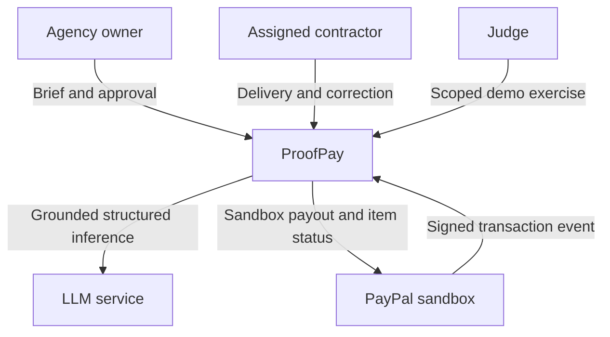
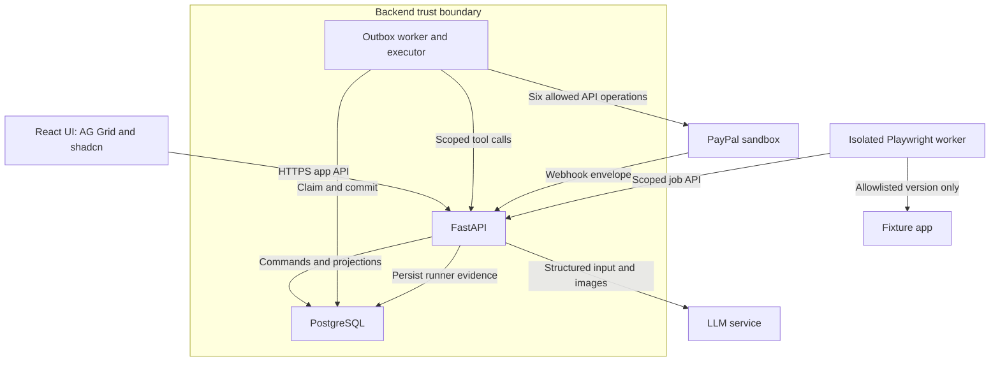
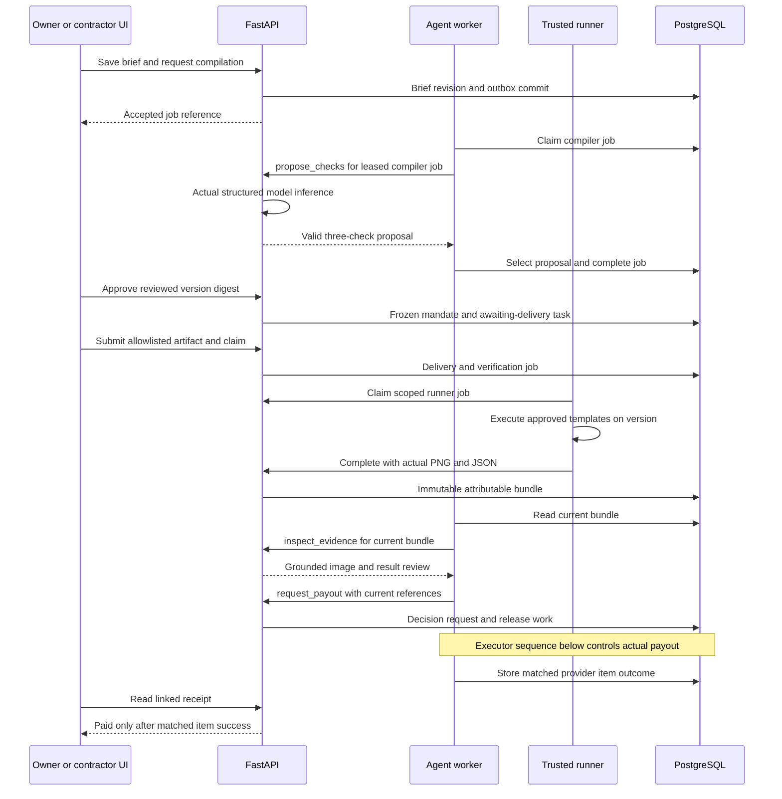
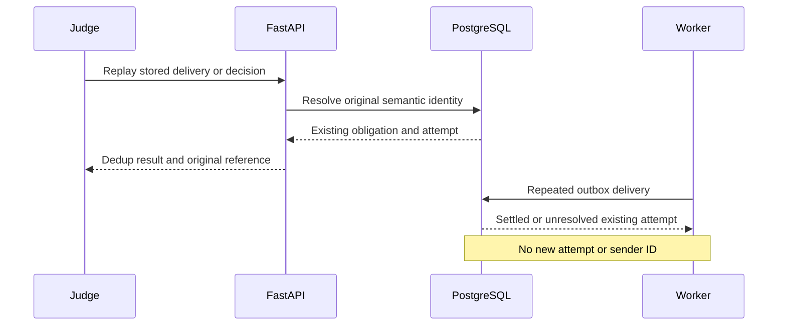
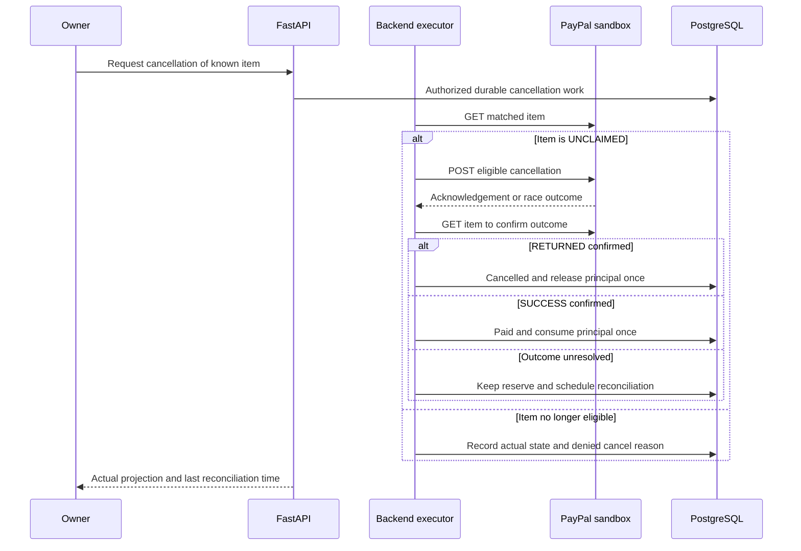
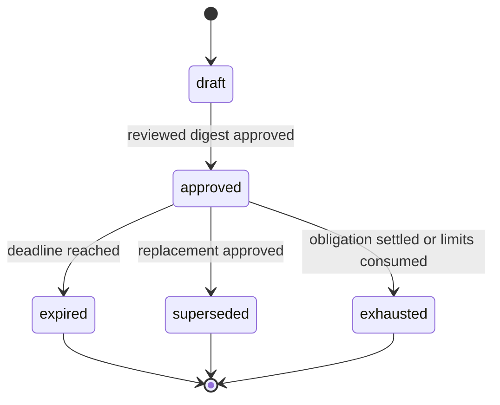
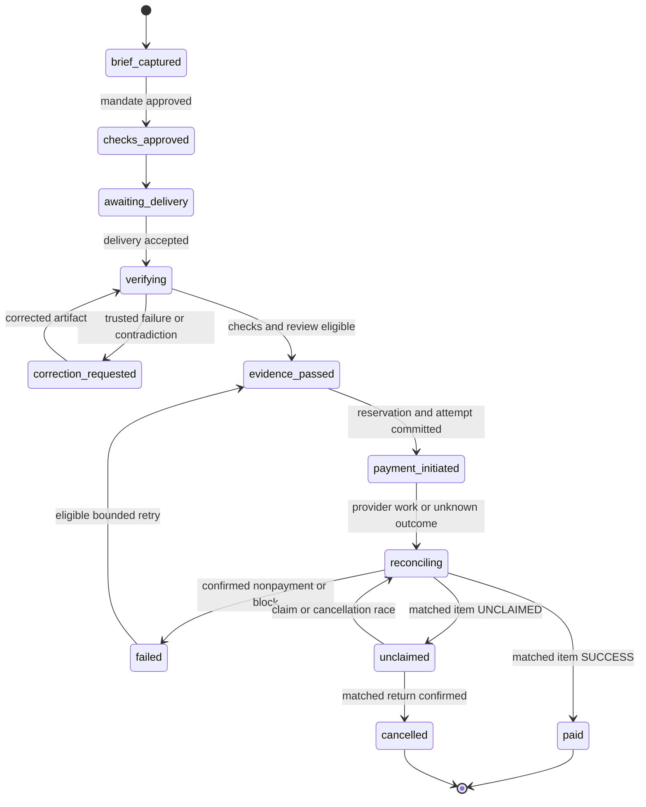
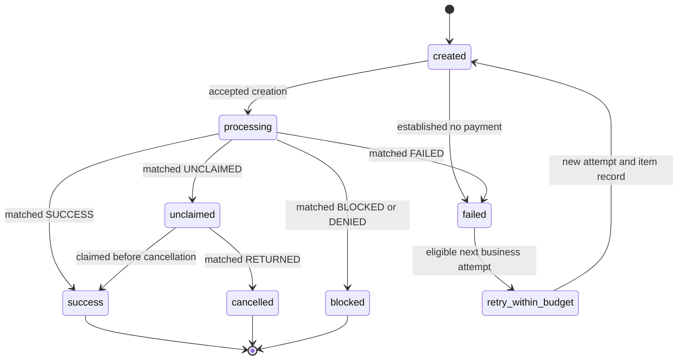

# ProofPay — System Design

Version: 0.1 | Date: 2 October 2026 | Phase: 2 | Status: design baseline; implementation and provider tests pending

> ProofPay compiles the review queue between 'work submitted' and 'payment released' into executable acceptance checks — and pays only when evidence passes.

## 1. Authority and design boundaries

Read [00-PROJECT_CONTEXT.md](00-PROJECT_CONTEXT.md) first. [02-PRD.md](02-PRD.md) defines 69 requirements and their acceptance criteria. This design implements those requirements without expanding the one-agency, one-fixture, two-recipient, USD, three-check, three-family scope. It supplements the PRD with transaction and service contracts. It does not claim a deployed app or executed sandbox integration.

The stack remains React/TypeScript, shadcn/ui, AG Grid, FastAPI, PostgreSQL, an outbox worker, an isolated Playwright runner, an LLM with structured tools and image input, Compose, and Render. PostgreSQL supplies durable jobs, evidence storage, accounting, and coordination. No Redis, Kafka, arbitrary-code execution service, or additional payment rail is introduced.

Approved payloads and source observations are immutable. Current status is a projection. One milestone has one payment obligation across all mandate versions. AI requests payment; the executor owns credentials and independently decides whether dispatch is permitted. Budget reservations are application controls, not escrow or a wallet-balance query.

## 2. C4-style context



ProofPay authenticates application roles. It does not require judges to log into PayPal or supply provider keys. All displayed people and business data are simulated. PayPal determines the actual financial outcome; the model determines neither provider status nor authority.

## 3. C4-style containers



The worker process holds PayPal credentials. Only its payment-executor module performs PayPal HTTP calls. The API's tool adapter holds the model key and performs structured inference for worker-scoped requests. API, frontend, runner, and fixture have no PayPal credentials. The runner also has no model key or direct database access. Its application service token is limited to runner job claim, heartbeat, and completion.

Render uses separate Docker services/workers. The runner polls the API's internal job endpoint; it does not need an inbound HTTP port or nested Docker daemon. The fixture is a separate private web service where available. API/internal-network reachability and evidence persistence remain Day 1 spike gates. [S07]

## 4. Components and responsibilities

| Component | Commands / reads | Durable records | Boundary / requirements |
| --- | --- | --- | --- |
| Session and authorization | Demo access, role switching, owner/contractor scope | Sessions, actor/audit identity | Server-scoped roles; NFR-06, NFR-19 |
| Brief service | Save revisions, compile, clarify | Brief revisions, compiler interactions | Only three families; FR-01–FR-02, FR-17–FR-18 |
| Mandate service | Draft, approve, supersede | Frozen snapshot, checks, protected recipient binding | Version digest and obligation history; FR-03, FR-19–FR-20 |
| Delivery service | Submit/resubmit, choose current artifact | Deliveries and claim hashes | Registry-only, no post-initiation replacement; FR-05, FR-21–FR-22 |
| Verification coordinator | Queue runner, validate completion, queue review | Verification jobs, bundles/results/artifacts | Current delivery/version binding; FR-06, FR-23 |
| AI adapter and agent runtime | API tool adapter performs inference; worker runtime calls the four seeded contracts | Versioned interactions, correction/decision requests | Finite calls; evidence validation; FR-07–FR-09, FR-24–FR-25 |
| Payment executor | OAuth, create, status, verify, eligible cancel | Attempts, payout items, observations, guard decisions | Six endpoints only; FR-04, FR-10–FR-12, FR-26–FR-31 |
| Ledger / obligation service | Reserve, consume, release | Obligations, budget entries and counters | Exact principal arithmetic; NFR-02–NFR-03, NFR-12 |
| Receipt projection | Role-scoped record and timeline | Reads immutable source chain | Item truth, unknown fees explicit; FR-13, FR-32–FR-33 |
| Judge service | Readiness, truthful seed, replay, safe reset | Demo runs, command receipts, audit | No history deletion or allowance refill; FR-16, FR-35–FR-37 |

The agent runtime is a bounded workflow controller. `propose_checks` and `inspect_evidence` use actual structured model inference. A validated failed review directs `request_correction`; a validated pass directs `request_payout`. Uncertainty requests neither payment nor a fabricated pass. The model output remains the recorded source of its recommendation. Exact prompts/schemas are in [06-AI_LAYER.md](06-AI_LAYER.md).

## 5. Execution and coordination contracts

### 5.1 Command identity and durable work

Mutating domain APIs require an `Idempotency-Key` and session authorization. Scope the receipt to agency, original principal, effective persona, canonical command family and key. Hash the canonical validated request with those identities and the referenced revision. The contractor submission aliases share the `submit_delivery` command family. Recheck current authorization before returning a cached result. A repeated key and identical digest returns the original resource/acknowledgement; changed data returns `409 IDEMPOTENCY_CONFLICT`. Retain receipts across reset.

Commit each API domain change, audit event, and outbox event in one PostgreSQL transaction. Payment API/tool commands queue release evaluation. The executor then validates eligibility and atomically commits reservation, numbered attempt, encrypted provider payload, stable sender IDs and dispatch work before any external send. Only the executor decrypts the pinned receiver. A `202` acknowledgement means durable work accepted, not model completion or PayPal success.

The outbox uses short claim transactions with `FOR UPDATE SKIP LOCKED`, a random lease token, expiry, and attempt count. Workers perform model/provider I/O outside a database transaction. Completion checks the lease token before updating job state. Defaults: 120s workflow lease, heartbeat every 20s, runner lease 120s, and bounded retries. Model stages have at most two calls with a proposed 45s call timeout. Runner execution targets 30s; it may fail rather than pass on timeout.

### 5.2 Shared locking protocol

Derive one PostgreSQL advisory-lock key from the seeded agency ID and store it as a unique configuration value. Acquire it before financial/reservation/reset/current-authority mutations, then lock rows in this order: agency allowance, task/obligation, mandate version, attempt, ledger projection. API commands use a transaction-level try-lock and return `409 WORKSPACE_BUSY` promptly if unavailable. Do not hold an API transaction while waiting for network I/O.

For each payout-creation HTTP send, the executor pins a dedicated database connection and holds the same session-level advisory lock through preflight, bounded provider call, and response/unknown-outcome persistence. The SQL transactions before/after HTTP remain short. Approval, supersession, delivery replacement, and reset use the same lock key, so they cannot race between dispatch checks and the outbound send. Release the session lock in `finally`; never return a locked connection to the pool. [S08]

If the worker crashes, the database releases its session lock. The persisted attempt still exists and remains unresolved. A new worker cannot create another attempt to replace it. A superseding approval after a crash changes future authority, not an already transmitted request. Reconciliation continues.

Runner/model jobs do not hold this agency lock during execution. Their completion records are immutable, then a short locked transaction checks current task/delivery/mandate pointers. A stale completion remains history and cannot enqueue eligible release.

### 5.3 Financial dispatch boundary

Recheck every PRD guard immediately before each create HTTP send: sandbox, current approved version, expiry, receiver/USD binding, latest artifact/mandate digests, three passing trusted checks, grounded review/resolution, obligation history, attempts, budget, and persisted identity. The current attempt's own reservation is allowed; a different unresolved attempt is not.

Store `sender_batch_id = pp_ + attempt UUID without hyphens` and `sender_item_id = ppi_ + the same UUID without hyphens` before dispatch. Both satisfy the documented length limits. Create one item per payout batch. Use the protected receiver with `recipient_type=EMAIL`, `recipient_wallet=PAYPAL`, and the frozen USD decimal amount. Do not accept model/browser receiver or amount fields. [S02]

A transport retransmission uses the exact stored payload and sender IDs. Default retransmission cutoff is the earlier of authority expiry and 24h after first dispatch, which is deliberately inside PayPal's documented 30-day protection window. Supersession also blocks retransmission. If an outcome remains unknown after the cutoff, retain reserve and require status/provider investigation. No fallback endpoint or newly generated ID is permitted. [S02]

An initial definitive provider rejection can establish nonpayment only if no prior send has an unknown outcome. A rejection on a later retransmission does not prove the earlier send failed. A matched terminal item failure is separate evidence. Classify retry eligibility from documented, spike-tested reasons; default an unrecognized failure to manual review.

## 6. Workflow sequences

### 6.1 Happy path and delegated payment



Compilation/review records are tied to a job and input digest. A current-pointer check at completion and again at dispatch prevents old model output from paying a newer delivery. The broken/corrected loop uses the same pipeline; correction changes the artifact, not the approved checks.

### 6.2 Contradiction and correction

```mermaid
sequenceDiagram
    participant Contractor
    participant API as FastAPI
    participant Runner as Trusted runner
    participant Agent as Agent worker
    participant DB as PostgreSQL
    Contractor->>API: Broken artifact and claim fixed
    API->>DB: Bound delivery and runner job
    Runner->>API: Failed overflow result and 320px PNG
    API->>DB: Actual artifact-bound evidence
    Agent->>DB: Read claim, results, and screenshot
    Agent->>API: inspect_evidence with scoped bundle
    API-->>Agent: Cited contradiction from actual inference
    Agent->>API: request_correction with findings and refs
    API->>DB: Failed review and internal portal message
    API-->>Contractor: Held with correction reason
    Contractor->>API: Corrected artifact submission
    API->>DB: New run; same frozen mandate
    Note over Agent,DB: Failed executable check never permits payout
```

### 6.3 Payout, webhook, and item reconciliation

```mermaid
sequenceDiagram
    participant UI
    participant Exec as Backend executor
    participant DB as PostgreSQL
    participant PayPal as PayPal sandbox
    participant API as Webhook ingress
    Exec->>DB: Lock, guard, reserve, persist IDs and outbox
    Exec->>PayPal: OAuth if cached token expired
    Exec->>PayPal: Create one bound payout item
    PayPal-->>Exec: Accepted batch reference
    Exec->>DB: Record reference; task reconciling
    PayPal->>API: Genuine signed transaction event
    API->>DB: Durable untrusted envelope
    API-->>PayPal: HTTP 200 after commit
    Exec->>DB: Claim verification work
    Exec->>PayPal: Verify event with configured webhook ID
    PayPal-->>Exec: Verification result
    Exec->>DB: Canonical verified event once
    Exec->>PayPal: GET batch to discover matched item
    Exec->>PayPal: GET item to confirm binding and status
    PayPal-->>Exec: Actual item state and observed fee
    Exec->>DB: Observation, projection, one-time ledger posting
    UI->>API: Read receipt
    API->>DB: Authorized receipt projection
    DB-->>API: Actual financial outcome
    API-->>UI: Linked payment record
    Note over Exec,DB: Batch success alone cannot mark paid
```

Polling the known item can recover even when webhook delivery is delayed. Raw event acknowledgement is not verification or payment completion.

### 6.4 Replay deduplication



Judge replay reuses a stored legitimate record. It cannot inject a forged verified event or delete dedup keys. A replayed historical record still resolves to its original namespace after reset.

### 6.5 Unknown response and stable sender retry

```mermaid
sequenceDiagram
    participant Worker
    participant DB as PostgreSQL
    participant PayPal as PayPal sandbox
    Worker->>DB: Persist attempt and exact payload
    Worker->>PayPal: Create with stored sender IDs
    Note over Worker,PayPal: Response lost; provider outcome unknown
    Worker->>DB: Record unknown; retain reservation
    alt Authority valid and retry cutoff open
        Worker->>DB: Recheck guards and same identity
        Worker->>PayPal: Retransmit identical request and IDs
        PayPal-->>Worker: Original batch or duplicate link
        Worker->>PayPal: Allowed GET for original batch and item
        Worker->>DB: Reconcile actual outcome
    else Authority ended or retry cutoff closed
        Worker->>DB: Hold creation; keep unknown reserve
        Note over Worker,DB: Known status lookup or provider investigation only
    end
```

Validate any duplicate-response HATEOAS link against the configured sandbox host and allowed GET path before following it. Do not perform an arbitrary link request. A new business attempt is different: confirmed eligible nonpayment permits a new numbered record within the same obligation and approved maximum.

### 6.6 Eligible unclaimed cancellation



Generic API-reference response examples are not evidence of a cancellation outcome. `RETURNED` must be observed on the matched item before app cancellation/budget release. Fee return behavior remains a provider-spike question. [S04]

## 7. Exact PayPal integration mapping

| Operation | Request source | Persisted response / interpretation |
| --- | --- | --- |
| `POST /v1/oauth2/token` | Executor client credentials, form `grant_type=client_credentials` | Cache `access_token`, `token_type`, `expires_in` in worker memory; refresh with expiry margin; redact all values |
| `POST /v1/payments/payouts` | Frozen binding/amount; stored `sender_batch_header.sender_batch_id`; one `items` entry with `sender_item_id` | `batch_header.payout_batch_id`, `batch_header.batch_status`, redacted body/hash; acknowledgement only |
| `GET /v1/payments/payouts/{batch_id}` | Stored/discovered batch bound to this payer and sender identity | Header sender identity; items matched by `payout_item.sender_item_id`; discover item ID; never infer paid from aggregate status |
| `GET /v1/payments/payouts-item/{item_id}` | Matched item ID under this attempt | `payout_item_id`, `payout_batch_id`, `sender_batch_id`, `payout_item`, `transaction_status`, `transaction_id` if present, `payout_item_fee` if present, errors/time fields |
| `POST /v1/notifications/verify-webhook-signature` | Persisted envelope headers mapped to `auth_algo`, `cert_url`, `transmission_id`, `transmission_sig`, `transmission_time`; configured `webhook_id`; original parsed `webhook_event` | `verification_status`; only verified genuine context may create canonical event and reconciliation work |
| `POST /v1/payments/payouts-item/{item_id}/cancel` | Previously rechecked matched unclaimed item; empty request body | Raw acknowledgement/error followed by item GET; do not equate HTTP 200 with returned money |

Retain protected raw provider responses for debugging with restricted access and encrypted receiver data where needed. Public projections/logs redact addresses, credentials, and tokens. The public app API never returns a PayPal token. Returned fees can be null/unknown; no data means no fee assertion. [S02–S05]

## 8. Webhook quarantine and trust

Ingress validates JSON syntax, duplicate JSON keys, required transmission headers, and a 64 KiB payload limit. It records raw bytes/hash and header values in `webhook_deliveries`, with no financial mutation. HTTP 200 follows durable commit; a storage failure returns 503 so delivery can be retried. The executor performs verification asynchronously through the allowed PayPal POST operation. It does not download `cert_url` itself. [S03]

`webhook_deliveries` is quarantine; it has no uniqueness constraint on the claimed provider event ID. `webhook_events` contains canonical verified events, unique by payer account and event ID. Verification success precedes inserting that canonical record. A forged envelope claiming a genuine event ID cannot occupy the verified dedup key. A verified duplicate links to the canonical event and creates no second transition.

Match verified payout events to a stored sender/batch/item identity; refresh actual item details before financial posting. Unmatched events remain reviewable and cannot attach to an arbitrary task. Preserve a new verified conflicting payload as an observation/anomaly rather than replacing the canonical first event. Unsupported event types are ignored for workflow purposes after recording authenticity.

Webhook and polling work coalesce by attempt. A lost webhook does not block known-item reconciliation. Delayed signed events remain subject to matching and dedup; mandate expiry does not discard a legitimate already-initiated transaction.

## 9. State machines and transition guards

### 9.1 Mandate version



| Transition | Required guard | Atomic effect |
| --- | --- | --- |
| draft → approved | Owner; expected draft digest; three valid checks; allowed pinned recipient; positive USD; cap/attempts/expiry valid | Frozen snapshot/checks, approval event, current-version pointer |
| approved → superseded | Owner approval of a valid replacement under agency lock | Append supersession; change pointer; preserve obligation, attempts and reservations |
| approved → expired | Database UTC time >= expiry | Projection/event update only; no cancellation or reserve release |
| approved → exhausted | Obligation successfully settled, or last permitted attempt has a confirmed terminal nonpayment/no-send outcome and no further initiation slot | Block new initiation; retain receipt/history |

Expired/superseded/exhausted snapshots remain readable. Superseding cannot move an unresolved item to another recipient. Replacement authority must obtain current version-bound evidence before any otherwise permitted initiation.

Allocating the last attempt does not prematurely exhaust its approved authority. The existing attempt may dispatch/retransmit while authority and cutoff remain valid; its ordinal must be within the approved limit. New allocation requires a remaining slot. This prevents a one-attempt mandate from blocking its own first send. Expiry/supersession still stop creation retransmission and preserve status/cancel recovery.

### 9.2 Delivery task



| Transition / hold | Guard | Required effect |
| --- | --- | --- |
| awaiting/correction → verifying | Assigned contractor, current approval, allowlisted digest, no unresolved/successful payment | New immutable delivery and job; select current delivery |
| verifying → correction_requested | Current run has executable failure or grounded contradiction | Persist failure, references and internal correction; no release work |
| verifying → verifying with review flag | Missing/error/uncertain or invalid model output | Explain stage/reason; retain evidence; finite retry or grounded owner resolution |
| verifying → evidence_passed | Latest digests; exactly three trusted passes; AI pass or valid ambiguity resolution | Persist review/resolution and decision request; not payment yet |
| evidence_passed → payment_initiated | All authority/history/budget guards under lock | Reserve principal, allocate attempt/sender IDs and outbox atomically |
| payment_initiated → reconciling | Dispatch begins/accepted or response unknown | Preserve attempt and reserve; show actual IDs only when returned |
| reconciling → paid | Matched item `SUCCESS` | Append observation; consume once; exhaust obligation; linked receipt |
| reconciling → failed | Confirmed nonpayment or explicit blocked/denied review | Classify financial certainty; release only when established; no automatic blocked retry |
| reconciling → unclaimed | Matched `UNCLAIMED` | Retain reserve; cancellation permitted only while eligible |
| unclaimed → cancelled | Matched `RETURNED` | Append return; release once; terminal task |
| failed → evidence_passed | Eligible confirmed nonpayment; remaining attempts; current evidence/authority | Enqueue new business initiation; old failed item unchanged |

Guard holds can remain in `evidence_passed`. Uncertainty remains in `verifying`; it does not invent a financial state. New versions invalidate prior version-bound eligibility. No task transition alone overrides raw provider evidence.

### 9.3 Payout item and retry orchestration



| Raw observation | Item projection | Ledger / retry policy |
| --- | --- | --- |
| No item yet / unknown creation | created or processing with unknown flag | Reserve retained; no new attempt |
| `PENDING` / `ONHOLD` | processing; hold flag where needed | Reserve retained |
| `SUCCESS` | success | Consume once; no new payment authority |
| `UNCLAIMED` | unclaimed | Reserve retained; eligible cancel/reconcile |
| `FAILED` | failed | Establish nonpayment; release once; classify eligibility |
| `BLOCKED` / `DENIED` | blocked | Review financial outcome; no automatic retry |
| `RETURNED` | cancelled with return reason | Release returned principal once |
| Unknown / unexpected regression / external refund | Retain observation and review flag | No inferred release or reopened authority |

`retry_within_budget` is an obligation action, not a mutation of a failed provider item. Store each attempt separately. Conflicting provider observations remain available and freeze automated action until resolved; never suppress a raw observation to make a uniqueness check appear successful.

## 10. Budget and attempt accounting

The agency has a configured durable principal allowance. Each approved version has its principal `max_total`. Money uses cents internally and two-decimal strings at public/provider boundaries. Maintain `reserved_cents` and `consumed_cents`; available configured allowance equals limit minus both. Fees are separate observations and do not reduce this principal-only cap.

| Posting | Reserved delta | Consumed delta | Proof required |
| --- | --- | --- | --- |
| Reserve attempt | +principal | 0 | Eligible committed initiation |
| Consume | -principal | +principal | Matched item success |
| Release | -principal | 0 | Confirmed nonpayment or return; never mere acknowledgement |

Every attempt has one reservation phase and at most one disposition phase. A unique disposition key prevents consume/release from both posting. Lock allowance and obligation, check nonnegative counters/caps, insert the ledger entry, update counters/projections and audit together. Duplicate observations see the existing posting and do not change totals.

Allocate an attempt number when a valid business initiation request is committed. This consumes an approved attempt even if a later pre-send guard aborts; transport retransmission never allocates another number. A fenced attempt proven never transmitted may release its reservation, but its history/number remains. If dispatch was recorded before a crash, treat its outcome as unknown until confirmed; do not assume no transmission.

At most one unresolved attempt and one successful attempt are permitted per obligation across versions. The unresolved flag also remains true for blocked outcomes whose financial effect is uncertain, so revision/retry cannot bypass investigation. The partial unique indexes and short locked transitions are specified in [05-DATA_MODEL.md](05-DATA_MODEL.md).

## 11. Security and access model

| Principal | Allowed access | Explicitly denied |
| --- | --- | --- |
| Owner session | Own agency briefs/approvals/evidence; grounded resolution; eligible retry/cancel; receipts | Approved-payload mutation, test-failure waiver, arbitrary receiver/base URL |
| Contractor session | Assigned tasks/checks/artifacts/corrections/receipts; pre-initiation submission | Other contractor data, approval, financial override, cancellation/reset |
| Judge session | Server-assigned demo owner/contractor personas, readiness, stored replay and guarded reset | Provider keys, raw protected bindings, forged verified events |
| Worker service | Scoped tool operations, durable orchestration, protected provider execution | Arbitrary model-provided endpoint, executable code or financial override |
| Runner service | Lease job, heartbeat, complete assigned run; fixture access | Financial endpoints/database, model/PayPal credentials, arbitrary URL/code |
| External LLM | Authorized brief/manifest or current evidence bytes and pseudonymous references | Provider credentials, session secrets, raw receiver address, direct HTTP execution |

Use opaque HttpOnly/Secure/SameSite=Lax session cookies and a session-bound `X-CSRF-Token` on mutating domain calls. Keep same-origin frontend/API where possible and a strict origin allowlist. Public demo access codes grant only the configured personas; a frontend role parameter cannot grant additional permissions. Rotate session IDs on role change and retain original judge identity in audit.

Every identifier lookup checks agency and effective contractor assignment. Use 404 for inaccessible foreign resource IDs and 403 for a forbidden operation on an otherwise visible task. Public response schemas exclude encrypted receivers and provider credentials. Render untrusted brief/claim/rationale as text.

Runner job tokens are separate from application sessions, limited by audience and lease/job context. Allow network only to the API internal job paths and trusted fixture host; apply image/template allowlists, read-only filesystem where practical, dropped capabilities and CPU/memory/time limits in Compose. Hosted network/isolation specifics must be tested rather than assumed from a Docker image alone.

## 12. Failure and recovery matrix

| Failure | Durable fact / user state | Recovery | Forbidden action |
| --- | --- | --- | --- |
| Compiler invalid/ambiguous | Versioned interaction/error; draft blocked | One bounded repair or owner clarification | Approve fewer/extra checks or invent baseline |
| Runner crash/timeout | Job lease and actual partial/error record | Lease recovery/new run on same approved inputs | Treat missing result as pass |
| Old runner/model result | Immutable stale completion | Verify current pointers; keep history | Dispatch old artifact/version |
| Model uncertain | Review flag with references | Grounded owner resolution if tests pass | Waive failed tests |
| Crash before initiation commit | No committed attempt/outbox/reserve | Repeat command with same key | Assume a payout was sent |
| Crash after initiation commit, before dispatch marker | Persisted prepared attempt | Recheck and execute same identity or fenced no-send abort | Allocate a replacement attempt |
| Crash after dispatch marker / response loss | Unknown existing attempt; reserve retained | Known status lookup or safe same-ID retry within authority/cutoff | Release reserve or mint new IDs |
| OAuth/transient provider failure | Stage error; original identity retained | Bounded retry; do not infer earlier nonpayment | Record later rejection as proof earlier send failed |
| Duplicate create response | Original batch link/identity | Validate host/path; GET original batch/item | Follow arbitrary link or send a new batch |
| Webhook verification unavailable | Durable quarantine pending | Worker retry and independent known-item poll | Change financial state from unverified body |
| Forged event ID | Invalid quarantine only | Genuine later event can verify normally | Poison canonical verified dedup |
| Item mismatch / unknown status | Raw observation and review flag | Investigate; no speculative posting | Paid from batch, different receiver or missing amount |
| Unclaimed/cancel race | Reserve retained, actual matched item | GET current state; release on return or consume on success | Release on cancel HTTP 200 |
| Reset during financial work | Existing lock/unresolved reference | Defer reset; safe fresh namespace later | Delete history/refill allowance |
| Missing genuine completed seed | Readiness incomplete | Execute/import a real completed bundle | Construct successful provider IDs |
| Hosted dependency down | Actual readiness stage failure | Fix service/funding/config; Compose route remains documented | Replace with fake successful UI |

## 13. Architecture decisions

| ADR | Decision | Reason / tradeoff | Validation and requirements |
| --- | --- | --- | --- |
| ADR-01 | PostgreSQL transactional outbox | Keeps commands and durable jobs together; requires leasing, idempotent consumers and maintenance | Crash/redelivery cases; FR-27, NFR-10 |
| ADR-02 | Immutable mandate snapshots with separate lifecycle projection | Preserves approval and permits expiry/supersession; more explicit version joins | Edit/stale approval/history cases; FR-03, FR-19–FR-20 |
| ADR-03 | Trusted template runner with fixed artifact registry | Produces attributable evidence within MVP scope; excludes arbitrary repositories/generated code | Tamper/custom-input denial; FR-05–FR-06, NFR-04 |
| ADR-04 | AI recommends through validated tools; executor rechecks authority | Useful compilation/image interpretation with bounded financial action; more stages and uncertainty holds | Contradiction/invalid-ref/guard cases; FR-07, FR-24, FR-26 |
| ADR-05 | AG Grid queue plus shadcn detail surfaces | Sorting/filtering and shared evidence/receipt workflow support design; specific licensing/module choice checked in UI phase | Complete queue walkthrough; FR-15, NFR-14 |
| ADR-06 | Separate Render API, worker, runner, fixture and durable database | Hosted judge experience using Docker; private reachability and service cost need a spike | Hosted/read-back checks; NFR-08, NFR-16 |
| ADR-07 | Small PNG/JSON artifacts stored in PostgreSQL | One durable source for controlled fixture; unsuitable for unrestricted/high-volume artifacts | Size/digest/reset preservation; NFR-13, NFR-18 |
| ADR-08 | Agency advisory lock around bounded payout send | Serializes authority/reset with dispatch; temporarily limits concurrent agency writes and consumes a pinned connection | Race tests, lock release after crash; FR-20, FR-27, FR-37 |
| ADR-09 | Quarantine separate from canonical verified events | Stops forged event IDs poisoning dedup; stores multiple delivery envelopes | Forged-then-genuine and replay cases; FR-28 |
| ADR-10 | Principal cap and fees separate | Enforceable without an extra fee-quote/balance API; does not promise fee-inclusive spend | Ledger/status and fee-unknown cases; FR-32, NFR-03 |

## 14. Operations and implementation handoff

Logs use structured JSON with request, job, delivery, run, mandate-version, obligation, attempt and event correlation. Never log provider tokens, Basic credentials, full receiver addresses, session cookies or complete unredacted provider bodies. Record raw-status/error codes, stage, duration and digest references. `livez` tests process responsiveness; `readyz` tests required database/configuration and reports worker/runner lease freshness separately.

Measure acknowledgement, queue wait, runner execution, model inference, provider HTTP and settlement waiting independently. The PRD p95 targets use 30 warm local runs and remain unproven. Background polling defaults to 5s for recent active items, then bounded increasing delay; obey provider backoff and stop automated hot polling on terminal outcomes. Persistent unknown/hold cases remain visible and investigable.

Seeding creates relative expiry, fresh IDs and one approved mid-flow task using an actual validated compiler interaction. A completed case points to an existing genuinely paid task and its archived runner/model/provider chain. The current queue includes that labeled historical example; it does not copy a provider item into a new obligation. Missing compiler/provider/archive evidence remains pending. Reset never deletes history or restores configured allowance/wallet funds. Preserve access through 15 December 2026, 16:00 UTC; operational target 16 December, 00:00 UTC.

Phase 3 will implement app modules, migrations, worker loops, executor wrapper, tool/runner endpoints, fixture, Compose, and real seed tooling. Phase 4 will implement the queue, evidence, receipt, portal and judge surfaces against [04-API_SPEC.yaml](04-API_SPEC.yaml). Local provider simulations must be labeled and separated from real sandbox proof.

Phase 2 document checks parse the OpenAPI YAML, resolve local references, check operation IDs/path parameters/authorization headers, compare all 69 requirement contracts with the PRD, compare embedded AI schemas with API definitions, check four synthetic output examples, and inspect declared SQL columns/unique FK targets. The specification contains 51 paths, 55 operations, 85 schemas, 36 DDL tables and 77 declared foreign keys. These checks do not execute migrations, validate rendered Mermaid layout, run the actual model/runner or prove provider behavior. Those acceptance checks remain Phase 3 work.

## 15. Red-team assessment

| Criterion | Challenge | Required evidence |
| --- | --- | --- |
| Technological Implementation | A state machine might conceal a scripted model or payment | Actual three-family inference, runner artifacts, independent guards, PayPal item and crash/replay/cancel tests |
| Design | Locks/holds might confuse users | Prompt acknowledgement/conflict, explicit stage/reason/allowed action, role-consistent receipt |
| Potential Impact | Architecture cannot prove agency value | BRD interviews/timing; do not equate fixture correctness with customer impact |
| Innovation | Fixed templates might resemble CI | Meaningful intent binding across families and image/claim contradiction driving correction/payment recommendation |
| Presentation | Provider latency and failures might exceed video time | Actual records, truthful waiting, genuine completed seed and visible elapsed-time cuts |

## 16. Sources

| Ref | Primary source | Use |
| --- | --- | --- |
| S01 | [Project context](00-PROJECT_CONTEXT.md), [PRD](02-PRD.md) | Binding product constraints and requirement IDs |
| S02 | [Create payout](https://developer.paypal.com/api/payments.payouts-batch/v1/payouts-post) and [batch details](https://developer.paypal.com/api/payments.payouts-batch/v1/payouts-get) | Sender IDs, request fields and time-bounded duplication |
| S03 | [Webhook integration](https://developer.paypal.com/api/rest/webhooks/rest/) | Postback verification, genuine events and receipt acknowledgement |
| S04 | [Cancel unclaimed item](https://developer.paypal.com/api/payments.payouts-batch/v1/payouts-item-cancel) | Eligibility; examples are not execution evidence |
| S05 | [Item details](https://developer.paypal.com/api/payments.payouts-batch/v1/payouts-item-get) | Actual item/fee/status fields |
| S06 | [Payouts webhook events](https://developer.paypal.com/payouts/webhooks/) | Event names and item reconciliation |
| S07 | [Render workers](https://render.com/docs/background-workers), [Docker](https://render.com/docs/docker) | Separate polling worker deployment |
| S08 | [PostgreSQL locking](https://www.postgresql.org/docs/17/explicit-locking.html) | Transaction/session advisory-lock behavior |

Public documentation establishes API behavior, not execution by ProofPay. All provider, race, isolation and performance acceptance evidence remains pending.

## 17. Requirement contracts and traceability

These selected architecture contracts reproduce the PRD acceptance criteria. The full 69-requirement register remains authoritative. Detailed rules above refine these contracts; they do not assign new requirement IDs.

| ID | Priority | Given / When / Then acceptance criteria | Criteria | Demo |
| --- | --- | --- | --- | --- |
| FR-03 | Must | Given a valid reviewed draft, when approved, then freeze its complete financial/check payload with approver, timestamp, digest and receiver binding; an attempted edit is rejected and must create a new version. | T, D | D04 |
| FR-04 | Must | Given a decision request, when any release guard fails, then make no dispatch and persist a specific hold/guard result; only fully eligible current authority may initiate. | T | D06, D08 |
| FR-05 | Must | Given an allowlisted artifact selection, when submitted, then persist its digest, delivery ID, submitting actor and approved mandate digest, and bind all resulting verification evidence to them. | T | D05, D07 |
| FR-06 | Must | Given three approved templates/parameters and a bound artifact, when the runner finishes, then persist a result for each check plus applicable screenshots, run ID, digests and timestamps; a timeout/error is not a pass. | T, P | D05–D08 |
| FR-07 | Must | Given the broken responsive artifact claiming “fixed,” when reviewed, then fail release and cite the submitted claim, failed overflow result and same-run 320px screenshot; every per-check verdict has valid attributable references. | T, N, P | D06 |
| FR-09 | Must | Given uncertain evidence review, when stored, then remain in `verifying` with `review_required=true` and no dispatch; only an authorized grounded resolution can clear ambiguity, and no failed executable check may be waived. | T, D | D06–D08 companion |
| FR-10 | Must | Given current passing evidence or permitted grounded resolution and valid authority, when the decision request is dispatched, then the executor binds receiver/USD amount from the frozen snapshot, calls only the sandbox payout endpoint and persists provider references. | T | D08–D09 |
| FR-11 | Must | Given creation, verified webhook or polling, when status is reconciled, then match batch/item/sender identity, receiver binding and amount, retain raw status, and mark paid only on matched item `SUCCESS`; batch success or a mismatch cannot mark paid. | T, P | D09–D10 |
| FR-12 | Must | Given a confirmed `UNCLAIMED` item, when the owner or configured recovery policy requests cancellation, then refresh eligibility, call cancel through the executor, and retain reservation until item reconciliation proves return. | T | D10 companion |
| FR-14 | Must | Given the same delivery/decision/event or lost creation response, when processed again, then resolve the existing obligation/attempt, reuse its persisted sender IDs for permitted retransmission, and create no second financial initiation. | T, P | D11 |
| FR-20 | Must | Given a revised draft for an existing milestone, when the new version is approved, then supersede prior initiation authority, preserve all snapshots/attempts/budget history, and require evidence bound to the new version before any permitted initiation; a prior successful payment cannot be paid again. | T | D04, D08 companion |
| FR-22 | Must | Given a newer delivery or mandate version, when an older runner/model job finishes, then retain its history but mark it ineligible for release; only the latest selected delivery with matching current authority can proceed. | T | D07–D08 companion |
| FR-26 | Must | Given any payout recommendation, when evaluated, then record each guard's pass/fail and a user-facing reason; a failed guard exposes a permitted next action while blocking dispatch. | T, D | D08 |
| FR-27 | Must | Given eligible release, when accepted by the backend, then commit reservation, attempt identity, sender IDs and outbox work together before external dispatch; a crash/retry recovers that same attempt rather than minting another. | T | D09, D11 companion |
| FR-28 | Must | Given a PayPal event, when ingested, then verify genuine signature/context through the executor before financial mutation, store event ID/hash, and enqueue matched item reconciliation once; unverifiable/mismatched events change no payment state and cannot poison dedup for a later genuine event. | T | D09–D10 companion |
| FR-29 | Must | Given provider-confirmed nonpayment, when retry is requested, then require a retryable reason, still-valid evidence/authority, remaining cap and fewer than approved attempts; create a new numbered attempt and sender IDs while retaining old item history. | T | D08–D10 companion |
| FR-30 | Must | Given an existing initiated/unknown/unclaimed attempt, when its mandate expires or is superseded, then stop new initiation under that version and continue status/recovery handling without deleting the attempt or releasing reserve speculatively. | T | D09–D10 companion |
| FR-31 | Must | Given cancellation races with a claim or returns an ambiguous acknowledgement, when refreshed, then show the actual matched success/return/pending state, post budget changes once, and never label cancelled or release principal solely from HTTP acceptance. | T | D10 companion |
| FR-37 | Must | Given a safe reset, when committed, then assign fresh task/mandate/run identifiers and append a reset event, retain prior attempts/evidence/webhook dedup, and leave wallet funding and durable workspace allowance unchanged. | T, D, P | D01, D11 companion |
| NFR-01 | Must | Given browser/model/runner/fixture configuration or a live-mode request, when inspected, then those components contain no PayPal secrets and live base URLs are rejected; only the backend executor can perform the six PayPal operations. | T | D08–D10 companion |
| NFR-02 | Must | Given concurrent workers, restart, transport uncertainty or replay after reset, when processed, then one obligation has at most one unresolved attempt and one successful payment; database uniqueness and locked transitions preserve this across mandate versions. | T | D09, D11 companion |
| NFR-03 | Must | Given dispatch/status/cancellation transitions, when posted, then reserve/consume/release principal once under both mandate cap and durable workspace allowance; pending/unclaimed/unknown funds remain reserved, fees separate, and totals never become negative. | T | D08–D10 companion |
| NFR-04 | Must | Given unapproved code/artifact/template/URL or a credential request, when a runner job is validated, then reject it; allowed runs use trusted fixture templates in a separate container without PayPal/model keys or financial write access. | T | D05–D08 companion |
| NFR-05 | Must | Given approval, submission, review, supersession, payout, reconciliation or reset, when recorded, then append actor/service identity, timestamp, correlation ID, relevant digests and source references without rewriting prior approval/evidence/attempt records. | T, D | D04, D06, D10–D11 |
| NFR-06 | Must | Given another contractor's identifier or owner-only operation, when any API/evidence endpoint is called, then deny unauthorized access independent of UI role selection; responses disclose no protected cross-role evidence/financial bindings. | T, D | D04, D12 companion |
| NFR-07 | Should | Given 30 measured warm local runs, when benchmarked, then target p95 accepted-command acknowledgement <=1s and runner execution <=30s; report queue, model and provider waiting separately with hardware/environment and actual results. | D, P | D03, D05–D10 |
| NFR-10 | Must | Given a crash before/after job claim, state commit or provider dispatch, when workers recover, then durable work resumes or remains visibly held, no accepted job vanishes, and redelivery preserves the same attempt and audit correlation. | T | D05, D09, D11 companion |
| NFR-11 | Must | Given token expiry, transient failure, lost response or delayed recovery, when handled, then use bounded backoff and the original attempt identity, retain unknown reservations, and prohibit unsafe late retransmission outside duplicate protection; secrets remain redacted. | T | D09–D10 companion |
| NFR-13 | Must | Given runner PNG/JSON artifacts, when ingested or fetched, then verify digest/task/run/mandate binding, enforce allowed media and size limits, and persist bytes durably; tampered or mismatched data cannot authorize release. | T | D05–D08 companion |
| NFR-18 | Must | Given reset, restart or cleanup during judging, when performed, then preserve approved snapshots, actual evidence/decisions, attempts/provider references, webhook dedup and budget history through the access window; expired tasks cannot cause unsafe re-initiation. | T | D10–D11 companion |

## 18. Assumptions

| ID | Assumption / default | Validation |
| --- | --- | --- |
| A-S01 | Worker holds provider keys; executor module alone performs PayPal HTTP | Secret-custody/configuration and outbound-path tests |
| A-S02 | Separate Render runner can reach internal API/fixture endpoints | Day 1 deployment/network/storage spike |
| A-S03 | Two sandbox recipient profiles support actual success and an eligible unclaimed scenario | Genuine provider tests; missing coverage stays pending |
| A-S04 | Session advisory locks can be held on a dedicated worker connection | Pool/timeout/crash tests; never release a still-locked connection |
| A-S05 | 24h create retry cutoff, 120s leases, 20s heartbeat and bounded 45s model calls are practical | Fault/latency measurements; limits are defaults, not measured results |
| A-S06 | Committed business initiation allocates an attempt number, including later no-send abort | Conservative attempt policy; number/history never reset by revision |
| A-S07 | Configured principal allowance remains finite and durable; fees separate | Exact ledger and reset tests |
| A-S08 | Actual completed bundle exists before judge-ready seeding | Readiness fails clearly until generated/imported |

## 19. Open Questions

| ID | Question | Default / decision point |
| --- | --- | --- |
| Q-S01 | Which LLM provider/model will implement structured tools and image input? | Provider-neutral adapter; choose before Phase 3 integration |
| Q-S02 | Will the budget cap remain principal-only? | Existing default; fee-inclusive change requires context/policy revision |
| Q-S03 | What team capacity and Render resources will be available? | 1–3 part-time builders; separate services and Compose route; validate hosting first |
