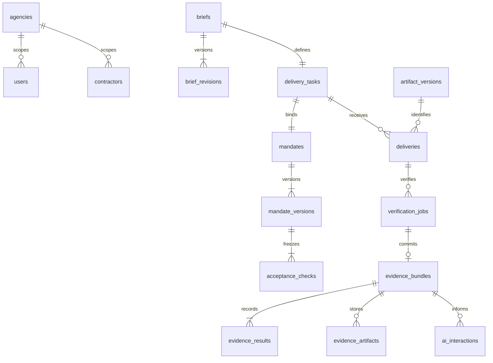
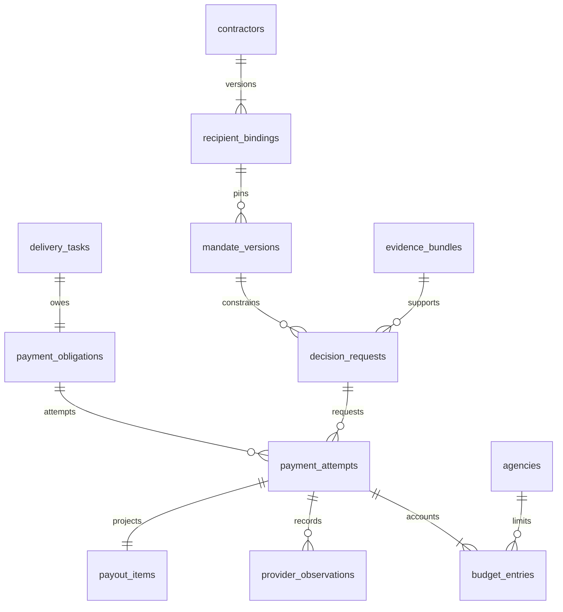
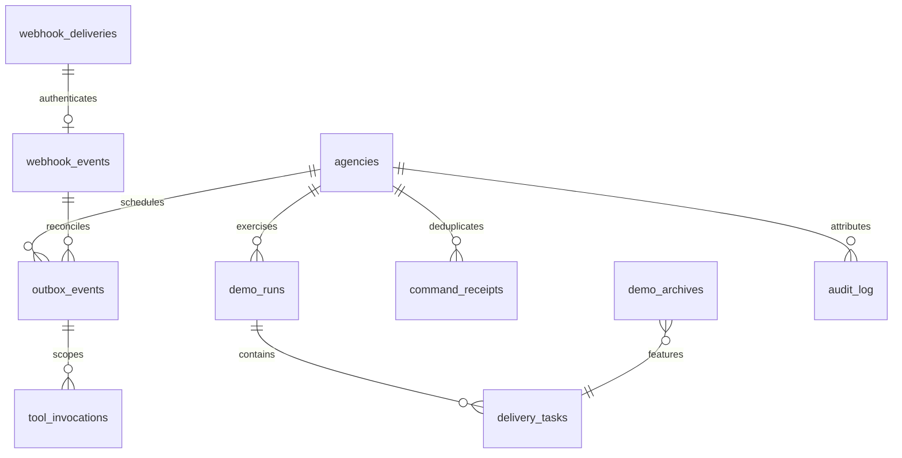

# ProofPay — Data Model

Version: 0.1 | Date: 2 October 2026 | Phase: 2 | Status: schema/DDL design; migration execution pending

> ProofPay compiles the review queue between 'work submitted' and 'payment released' into executable acceptance checks — and pays only when evidence passes.

## 1. Authority and conventions

The schema implements [02-PRD.md](02-PRD.md) and the transaction protocol in [03-SYSTEM_DESIGN.md](03-SYSTEM_DESIGN.md). These are DDL sketches for the Phase 3 migration, not an already deployed database. UUIDs are generated by the application; timestamps use PostgreSQL `timestamptz` and UTC. Money uses integer cents. Public/provider amounts use exact two-decimal USD strings.

Every business table carries `agency_id`. Composite foreign keys protect same-agency associations. One seeded agency, one fixture and two contractor references are enforced by application configuration, catalog checks and the absence of public creation endpoints. Registry/recipient maintenance remains an operator action, not a model/contractor tool.

Approved payloads, accepted deliveries, evidence, AI responses, provider observations, ledger entries and audit events are immutable sources. Current pointers, leases and workflow/payment status are projections. Mutation of a projection must append the corresponding source event. Financial source rows never disappear during judge reset.

## 2. ERD — delivery and evidence



## 3. ERD — authority and money



## 4. ERD — orchestration and judge history



These diagrams show logical relationships, including records that are absent before a stage completes. Physical nullable foreign keys and partial unique indexes below govern the actual lifecycle. Outbox JSON references are validated by the service; the diagrams do not imply every JSON member is a database FK.

## 5. Table responsibilities

| Group | Tables | Integrity purpose |
| --- | --- | --- |
| Identity and demo | `agencies`, `users`, `contractors`, `recipient_bindings`, `sessions`, `demo_runs`, `demo_archives` | Assigned roles, pinned receivers, finite allowance and retained genuine examples |
| Intent and authority | `briefs`, `brief_revisions`, `compilations`, `mandates`, `mandate_versions`, `acceptance_checks` | Revision/digest binding, actual compiler lineage, exactly three approved checks |
| Verification | `fixture_manifests`, `artifact_versions`, `delivery_tasks`, `deliveries`, `verification_jobs`, `evidence_bundles`, `evidence_results`, `evidence_artifacts` | Known software version, trusted results/bytes and immutable current/history distinction |
| Decisions | `ai_interactions`, `corrections`, `review_resolutions`, `decision_requests` | Grounded model output, human uncertainty resolution and bounded release requests |
| Money | `payment_obligations`, `payment_attempts`, `payout_items`, `provider_observations`, `budget_entries` | One obligation, stable attempt identity, matched item truth and once-only postings |
| Recovery | `outbox_events`, `tool_invocations`, `command_receipts`, `webhook_deliveries`, `webhook_events`, `audit_log` | Durable leasing, command dedup, quarantine/verification separation and attributable recovery |

Extra supporting tables implement existing PRD controls; they introduce no new audience, payment rail or fixture. Public response models never expose protected receiver ciphertext, service tokens, cookies or raw provider credentials.

## 6. DDL sketches

Create tables in dependency order. Cyclic current-pointer FKs are added afterward. The migration must also apply the triggers and privileges described below. Application validation complements SQL; a SQL `CHECK` cannot safely enforce an arbitrary cross-table count.

```sql
CREATE TABLE agencies (
  id uuid PRIMARY KEY,
  name text NOT NULL,
  advisory_lock_key bigint NOT NULL UNIQUE,
  principal_limit_cents bigint NOT NULL CHECK (principal_limit_cents > 0),
  reserved_cents bigint NOT NULL DEFAULT 0 CHECK (reserved_cents >= 0),
  consumed_cents bigint NOT NULL DEFAULT 0 CHECK (consumed_cents >= 0),
  current_demo_run_id uuid,
  CHECK (reserved_cents + consumed_cents <= principal_limit_cents)
);

CREATE TABLE users (
  id uuid PRIMARY KEY,
  agency_id uuid NOT NULL REFERENCES agencies(id),
  role text NOT NULL CHECK (role IN ('owner','contractor','judge')),
  display_name text NOT NULL,
  UNIQUE (agency_id,id)
);

CREATE TABLE contractors (
  id uuid PRIMARY KEY,
  agency_id uuid NOT NULL REFERENCES agencies(id),
  user_id uuid NOT NULL,
  recipient_ref text NOT NULL CHECK (recipient_ref IN ('contractor_maya','contractor_leo')),
  display_name text NOT NULL,
  current_binding_id uuid,
  UNIQUE (agency_id,id), UNIQUE (agency_id,recipient_ref), UNIQUE (agency_id,user_id),
  FOREIGN KEY (agency_id,user_id) REFERENCES users(agency_id,id)
);

CREATE TABLE recipient_bindings (
  id uuid PRIMARY KEY,
  agency_id uuid NOT NULL,
  contractor_id uuid NOT NULL,
  receiver_ciphertext bytea NOT NULL,
  receiver_hash text NOT NULL CHECK (receiver_hash ~ '^[0-9a-f]{64}$'),
  key_version text NOT NULL,
  confirmed_at timestamptz NOT NULL,
  created_at timestamptz NOT NULL DEFAULT now(),
  UNIQUE (agency_id,id), UNIQUE (agency_id,contractor_id,id),
  FOREIGN KEY (agency_id,contractor_id) REFERENCES contractors(agency_id,id)
);
ALTER TABLE contractors ADD FOREIGN KEY (agency_id,id,current_binding_id)
  REFERENCES recipient_bindings(agency_id,contractor_id,id);

CREATE TABLE sessions (
  id uuid PRIMARY KEY,
  agency_id uuid NOT NULL,
  principal_user_id uuid NOT NULL,
  effective_user_id uuid NOT NULL,
  cookie_hash text NOT NULL UNIQUE,
  csrf_nonce text NOT NULL,
  is_judge boolean NOT NULL,
  expires_at timestamptz NOT NULL,
  revoked_at timestamptz,
  FOREIGN KEY (agency_id,principal_user_id) REFERENCES users(agency_id,id),
  FOREIGN KEY (agency_id,effective_user_id) REFERENCES users(agency_id,id)
);

CREATE TABLE demo_runs (
  id uuid PRIMARY KEY,
  agency_id uuid NOT NULL REFERENCES agencies(id),
  state text NOT NULL CHECK (state IN ('active','archived')),
  featured_archive_id uuid,
  created_at timestamptz NOT NULL DEFAULT now(),
  UNIQUE (agency_id,id)
);
CREATE UNIQUE INDEX one_active_demo_run ON demo_runs(agency_id) WHERE state='active';
ALTER TABLE agencies ADD FOREIGN KEY (id,current_demo_run_id) REFERENCES demo_runs(agency_id,id);

CREATE TABLE fixture_manifests (
  id uuid PRIMARY KEY,
  agency_id uuid NOT NULL REFERENCES agencies(id),
  fixture_ref text NOT NULL CHECK (fixture_ref='checkout_fixture'),
  version integer NOT NULL CHECK (version > 0),
  digest text NOT NULL CHECK (digest ~ '^[0-9a-f]{64}$'),
  manifest jsonb NOT NULL CHECK (jsonb_typeof(manifest)='object'),
  UNIQUE (agency_id,id), UNIQUE (agency_id,fixture_ref,version)
);

CREATE TABLE artifact_versions (
  id uuid PRIMARY KEY,
  agency_id uuid NOT NULL,
  manifest_id uuid NOT NULL,
  artifact_ref text NOT NULL,
  family text NOT NULL CHECK (family IN ('responsive_css','api_endpoint','keyboard_accessibility')),
  digest text NOT NULL CHECK (digest ~ '^[0-9a-f]{64}$'),
  relative_path text NOT NULL,
  UNIQUE (agency_id,id), UNIQUE (agency_id,artifact_ref),
  FOREIGN KEY (agency_id,manifest_id) REFERENCES fixture_manifests(agency_id,id)
);

CREATE TABLE briefs (
  id uuid PRIMARY KEY,
  agency_id uuid NOT NULL REFERENCES agencies(id),
  current_revision_id uuid,
  created_by uuid NOT NULL,
  created_at timestamptz NOT NULL DEFAULT now(),
  UNIQUE (agency_id,id),
  FOREIGN KEY (agency_id,created_by) REFERENCES users(agency_id,id)
);

CREATE TABLE brief_revisions (
  id uuid PRIMARY KEY,
  agency_id uuid NOT NULL,
  brief_id uuid NOT NULL,
  revision integer NOT NULL CHECK (revision > 0),
  title text NOT NULL CHECK (length(title) BETWEEN 1 AND 160),
  body text NOT NULL CHECK (length(body) BETWEEN 1 AND 4000),
  family text NOT NULL CHECK (family IN ('responsive_css','api_endpoint','keyboard_accessibility')),
  manifest_id uuid NOT NULL,
  proposed_terms jsonb NOT NULL,
  digest text NOT NULL CHECK (digest ~ '^[0-9a-f]{64}$'),
  created_at timestamptz NOT NULL DEFAULT now(),
  UNIQUE (agency_id,id), UNIQUE (agency_id,brief_id,id), UNIQUE (agency_id,brief_id,revision),
  FOREIGN KEY (agency_id,brief_id) REFERENCES briefs(agency_id,id),
  FOREIGN KEY (agency_id,manifest_id) REFERENCES fixture_manifests(agency_id,id)
);
ALTER TABLE briefs ADD FOREIGN KEY (agency_id,id,current_revision_id)
  REFERENCES brief_revisions(agency_id,brief_id,id);

CREATE TABLE delivery_tasks (
  id uuid PRIMARY KEY,
  agency_id uuid NOT NULL,
  demo_run_id uuid NOT NULL,
  brief_id uuid NOT NULL,
  state text NOT NULL CHECK (state IN ('brief_captured','checks_approved','awaiting_delivery',
    'verifying','correction_requested','evidence_passed','payment_initiated','reconciling',
    'paid','failed','unclaimed','cancelled')),
  current_delivery_id uuid,
  current_bundle_id uuid,
  review_required boolean NOT NULL DEFAULT false,
  hold_reasons jsonb NOT NULL DEFAULT '[]'::jsonb,
  version bigint NOT NULL DEFAULT 1,
  updated_at timestamptz NOT NULL DEFAULT now(),
  UNIQUE (agency_id,id), UNIQUE (agency_id,brief_id),
  FOREIGN KEY (agency_id,demo_run_id) REFERENCES demo_runs(agency_id,id),
  FOREIGN KEY (agency_id,brief_id) REFERENCES briefs(agency_id,id)
);

CREATE TABLE mandates (
  id uuid PRIMARY KEY,
  agency_id uuid NOT NULL,
  task_id uuid NOT NULL,
  current_version_id uuid,
  UNIQUE (agency_id,id), UNIQUE (agency_id,task_id), UNIQUE (agency_id,task_id,id),
  FOREIGN KEY (agency_id,task_id) REFERENCES delivery_tasks(agency_id,id)
);

CREATE TABLE mandate_versions (
  id uuid PRIMARY KEY,
  agency_id uuid NOT NULL,
  task_id uuid NOT NULL,
  mandate_id uuid NOT NULL,
  version integer NOT NULL CHECK (version > 0),
  brief_revision_id uuid NOT NULL,
  compilation_id uuid NOT NULL,
  contractor_id uuid NOT NULL,
  recipient_binding_id uuid NOT NULL,
  lifecycle_state text NOT NULL CHECK (lifecycle_state IN ('draft','approved','expired','superseded','exhausted')),
  amount_cents bigint NOT NULL CHECK (amount_cents > 0),
  principal_cap_cents bigint NOT NULL CHECK (principal_cap_cents >= amount_cents),
  currency text NOT NULL CHECK (currency='USD'),
  max_attempts smallint NOT NULL CHECK (max_attempts BETWEEN 1 AND 3),
  expires_at timestamptz NOT NULL,
  public_payload jsonb NOT NULL,
  payload_digest text NOT NULL CHECK (payload_digest ~ '^[0-9a-f]{64}$'),
  approved_by uuid,
  approved_at timestamptz,
  created_at timestamptz NOT NULL DEFAULT now(),
  UNIQUE (agency_id,id), UNIQUE (agency_id,task_id,id), UNIQUE (agency_id,mandate_id,id),
  UNIQUE (agency_id,mandate_id,version),
  FOREIGN KEY (agency_id,task_id,mandate_id) REFERENCES mandates(agency_id,task_id,id),
  FOREIGN KEY (agency_id,brief_revision_id) REFERENCES brief_revisions(agency_id,id),
  FOREIGN KEY (agency_id,contractor_id,recipient_binding_id) REFERENCES recipient_bindings(agency_id,contractor_id,id),
  FOREIGN KEY (agency_id,approved_by) REFERENCES users(agency_id,id),
  CHECK ((approved_at IS NULL AND approved_by IS NULL AND lifecycle_state='draft') OR
         (approved_at IS NOT NULL AND approved_by IS NOT NULL AND lifecycle_state<>'draft'))
);
CREATE UNIQUE INDEX one_current_approved_version ON mandate_versions(agency_id,mandate_id)
  WHERE lifecycle_state='approved';
ALTER TABLE mandates ADD FOREIGN KEY (agency_id,id,current_version_id)
  REFERENCES mandate_versions(agency_id,mandate_id,id);

CREATE TABLE acceptance_checks (
  id uuid PRIMARY KEY,
  agency_id uuid NOT NULL,
  mandate_version_id uuid NOT NULL,
  check_id text NOT NULL CHECK (check_id IN ('C01','C02','C03')),
  template_type text NOT NULL CHECK (template_type IN ('viewport_no_horizontal_overflow',
    'cart_total_unchanged','keyboard_checkout_reachable','api_status','api_schema',
    'api_total_matches_fixture','keyboard_activation','accessible_control_name')),
  params jsonb NOT NULL CHECK (jsonb_typeof(params)='object'),
  compiled_by text NOT NULL CHECK (compiled_by='ai'),
  approved boolean NOT NULL DEFAULT false,
  UNIQUE (agency_id,id), UNIQUE (agency_id,mandate_version_id,id),
  UNIQUE (agency_id,mandate_version_id,check_id), UNIQUE (agency_id,mandate_version_id,template_type),
  FOREIGN KEY (agency_id,mandate_version_id) REFERENCES mandate_versions(agency_id,id)
);

CREATE TABLE deliveries (
  id uuid PRIMARY KEY,
  agency_id uuid NOT NULL,
  task_id uuid NOT NULL,
  mandate_version_id uuid NOT NULL,
  artifact_version_id uuid NOT NULL,
  artifact_digest text NOT NULL,
  mandate_digest text NOT NULL,
  submitted_by uuid NOT NULL,
  claim text NOT NULL CHECK (length(claim) BETWEEN 1 AND 4000),
  claim_digest text NOT NULL,
  sequence integer NOT NULL CHECK (sequence > 0),
  previous_delivery_id uuid,
  created_at timestamptz NOT NULL DEFAULT now(),
  UNIQUE (agency_id,id), UNIQUE (agency_id,task_id,id),
  UNIQUE (agency_id,task_id,mandate_version_id,id), UNIQUE (agency_id,task_id,sequence),
  FOREIGN KEY (agency_id,task_id,mandate_version_id) REFERENCES mandate_versions(agency_id,task_id,id),
  FOREIGN KEY (agency_id,artifact_version_id) REFERENCES artifact_versions(agency_id,id),
  FOREIGN KEY (agency_id,submitted_by) REFERENCES users(agency_id,id),
  FOREIGN KEY (agency_id,task_id,previous_delivery_id) REFERENCES deliveries(agency_id,task_id,id)
);
ALTER TABLE delivery_tasks ADD FOREIGN KEY (agency_id,id,current_delivery_id)
  REFERENCES deliveries(agency_id,task_id,id);

CREATE TABLE verification_jobs (
  id uuid PRIMARY KEY,
  agency_id uuid NOT NULL,
  task_id uuid NOT NULL,
  delivery_id uuid NOT NULL,
  state text NOT NULL CHECK (state IN ('queued','running','completed','error','stale')),
  inputs jsonb NOT NULL,
  input_digest text NOT NULL,
  worker_id text,
  lease_token uuid,
  lease_until timestamptz,
  lease_attempt integer NOT NULL DEFAULT 0,
  started_at timestamptz,
  completed_at timestamptz,
  UNIQUE (agency_id,id), UNIQUE (agency_id,task_id,id),
  UNIQUE (agency_id,task_id,delivery_id,id),
  FOREIGN KEY (agency_id,task_id,delivery_id) REFERENCES deliveries(agency_id,task_id,id)
);

CREATE TABLE evidence_bundles (
  id uuid PRIMARY KEY,
  agency_id uuid NOT NULL,
  task_id uuid NOT NULL,
  delivery_id uuid NOT NULL,
  mandate_version_id uuid NOT NULL,
  verification_job_id uuid NOT NULL,
  artifact_digest text NOT NULL,
  mandate_digest text NOT NULL,
  bundle_digest text NOT NULL,
  manifest_id uuid NOT NULL,
  created_at timestamptz NOT NULL DEFAULT now(),
  UNIQUE (agency_id,id), UNIQUE (agency_id,task_id,id),
  UNIQUE (agency_id,mandate_version_id,id), UNIQUE (agency_id,verification_job_id),
  UNIQUE (agency_id,task_id,mandate_version_id,id),
  FOREIGN KEY (agency_id,task_id,mandate_version_id,delivery_id)
    REFERENCES deliveries(agency_id,task_id,mandate_version_id,id),
  FOREIGN KEY (agency_id,task_id,delivery_id,verification_job_id)
    REFERENCES verification_jobs(agency_id,task_id,delivery_id,id),
  FOREIGN KEY (agency_id,manifest_id) REFERENCES fixture_manifests(agency_id,id)
);
ALTER TABLE delivery_tasks ADD FOREIGN KEY (agency_id,id,current_bundle_id)
  REFERENCES evidence_bundles(agency_id,task_id,id);

CREATE TABLE evidence_results (
  id uuid PRIMARY KEY,
  agency_id uuid NOT NULL,
  bundle_id uuid NOT NULL,
  mandate_version_id uuid NOT NULL,
  acceptance_check_id uuid NOT NULL,
  outcome text NOT NULL CHECK (outcome IN ('pass','fail','error')),
  observations jsonb NOT NULL,
  result_digest text NOT NULL,
  completed_at timestamptz NOT NULL,
  UNIQUE (agency_id,id), UNIQUE (agency_id,bundle_id,acceptance_check_id),
  FOREIGN KEY (agency_id,mandate_version_id,bundle_id) REFERENCES evidence_bundles(agency_id,mandate_version_id,id),
  FOREIGN KEY (agency_id,mandate_version_id,acceptance_check_id) REFERENCES acceptance_checks(agency_id,mandate_version_id,id),
  CHECK (octet_length(observations::text) <= 65536)
);

CREATE TABLE evidence_artifacts (
  id uuid PRIMARY KEY,
  agency_id uuid NOT NULL,
  bundle_id uuid NOT NULL,
  check_id text CHECK (check_id IN ('C01','C02','C03')),
  media_type text NOT NULL CHECK (media_type IN ('image/png','application/json')),
  digest text NOT NULL CHECK (digest ~ '^[0-9a-f]{64}$'),
  content bytea NOT NULL,
  created_at timestamptz NOT NULL DEFAULT now(),
  UNIQUE (agency_id,id),
  FOREIGN KEY (agency_id,bundle_id) REFERENCES evidence_bundles(agency_id,id),
  CHECK (octet_length(content) <= CASE WHEN media_type='image/png' THEN 524288 ELSE 65536 END)
);
```

### 6.1 Decisions, orchestration and money

```sql
CREATE TABLE outbox_events (
  id uuid PRIMARY KEY,
  agency_id uuid NOT NULL REFERENCES agencies(id),
  task_id uuid,
  event_type text NOT NULL,
  dedup_key text NOT NULL,
  payload jsonb NOT NULL,
  stage_state jsonb NOT NULL DEFAULT '{}'::jsonb,
  state text NOT NULL CHECK (state IN ('ready','leased','done','failed','held')),
  available_at timestamptz NOT NULL DEFAULT now(),
  lease_token uuid,
  lease_until timestamptz,
  attempt_count integer NOT NULL DEFAULT 0 CHECK (attempt_count >= 0),
  last_error_code text,
  created_at timestamptz NOT NULL DEFAULT now(),
  updated_at timestamptz NOT NULL DEFAULT now(),
  UNIQUE (agency_id,id), UNIQUE (agency_id,dedup_key),
  FOREIGN KEY (agency_id,task_id) REFERENCES delivery_tasks(agency_id,id)
);

CREATE TABLE ai_interactions (
  id uuid PRIMARY KEY,
  agency_id uuid NOT NULL,
  job_id uuid NOT NULL,
  stage text NOT NULL CHECK (stage IN ('compiler','reviewer')),
  brief_revision_id uuid,
  bundle_id uuid,
  model_ref text NOT NULL,
  prompt_version text NOT NULL,
  schema_version text NOT NULL,
  input_digest text NOT NULL,
  input_refs jsonb NOT NULL,
  output jsonb,
  output_digest text,
  validated boolean NOT NULL,
  error_code text,
  usage jsonb,
  created_at timestamptz NOT NULL DEFAULT now(),
  UNIQUE (agency_id,id),
  FOREIGN KEY (agency_id,job_id) REFERENCES outbox_events(agency_id,id),
  FOREIGN KEY (agency_id,brief_revision_id) REFERENCES brief_revisions(agency_id,id),
  FOREIGN KEY (agency_id,bundle_id) REFERENCES evidence_bundles(agency_id,id),
  CHECK ((stage='compiler' AND brief_revision_id IS NOT NULL AND bundle_id IS NULL) OR
         (stage='reviewer' AND bundle_id IS NOT NULL AND brief_revision_id IS NULL))
);

CREATE TABLE compilations (
  id uuid PRIMARY KEY,
  agency_id uuid NOT NULL,
  brief_revision_id uuid NOT NULL,
  job_id uuid NOT NULL,
  status text NOT NULL CHECK (status IN ('queued','running','ready','ambiguous','failed','stale')),
  interaction_id uuid,
  proposal jsonb,
  created_at timestamptz NOT NULL DEFAULT now(),
  UNIQUE (agency_id,id),
  FOREIGN KEY (agency_id,brief_revision_id) REFERENCES brief_revisions(agency_id,id),
  FOREIGN KEY (agency_id,job_id) REFERENCES outbox_events(agency_id,id),
  FOREIGN KEY (agency_id,interaction_id) REFERENCES ai_interactions(agency_id,id)
);
ALTER TABLE mandate_versions ADD FOREIGN KEY (agency_id,compilation_id) REFERENCES compilations(agency_id,id);

CREATE TABLE corrections (
  id uuid PRIMARY KEY,
  agency_id uuid NOT NULL,
  task_id uuid NOT NULL,
  delivery_id uuid NOT NULL,
  bundle_id uuid NOT NULL,
  review_interaction_id uuid NOT NULL,
  contractor_message text NOT NULL CHECK (length(contractor_message) BETWEEN 1 AND 2000),
  evidence_refs jsonb NOT NULL,
  created_at timestamptz NOT NULL DEFAULT now(),
  UNIQUE (agency_id,id), UNIQUE (agency_id,bundle_id,review_interaction_id),
  FOREIGN KEY (agency_id,task_id,delivery_id) REFERENCES deliveries(agency_id,task_id,id),
  FOREIGN KEY (agency_id,task_id,bundle_id) REFERENCES evidence_bundles(agency_id,task_id,id),
  FOREIGN KEY (agency_id,review_interaction_id) REFERENCES ai_interactions(agency_id,id)
);

CREATE TABLE review_resolutions (
  id uuid PRIMARY KEY,
  agency_id uuid NOT NULL,
  task_id uuid NOT NULL,
  bundle_id uuid NOT NULL,
  review_interaction_id uuid NOT NULL,
  resolved_by uuid NOT NULL,
  rationale text NOT NULL CHECK (length(rationale) BETWEEN 1 AND 1000),
  evidence_refs jsonb NOT NULL,
  created_at timestamptz NOT NULL DEFAULT now(),
  UNIQUE (agency_id,id), UNIQUE (agency_id,bundle_id,review_interaction_id),
  FOREIGN KEY (agency_id,task_id,bundle_id) REFERENCES evidence_bundles(agency_id,task_id,id),
  FOREIGN KEY (agency_id,review_interaction_id) REFERENCES ai_interactions(agency_id,id),
  FOREIGN KEY (agency_id,resolved_by) REFERENCES users(agency_id,id)
);

CREATE TABLE decision_requests (
  id uuid PRIMARY KEY,
  agency_id uuid NOT NULL,
  task_id uuid NOT NULL,
  mandate_version_id uuid NOT NULL,
  bundle_id uuid NOT NULL,
  source text NOT NULL CHECK (source IN ('ai','owner_resolution','owner_reevaluation')),
  review_interaction_id uuid NOT NULL,
  state text NOT NULL CHECK (state IN ('queued','held','deduplicated')),
  evaluation_generation integer NOT NULL DEFAULT 1,
  request_digest text NOT NULL,
  evidence_refs jsonb NOT NULL,
  created_at timestamptz NOT NULL DEFAULT now(),
  UNIQUE (agency_id,id), UNIQUE (agency_id,task_id,id),
  UNIQUE (agency_id,task_id,mandate_version_id,bundle_id),
  UNIQUE (agency_id,task_id,mandate_version_id,id),
  FOREIGN KEY (agency_id,task_id,mandate_version_id) REFERENCES mandate_versions(agency_id,task_id,id),
  FOREIGN KEY (agency_id,task_id,mandate_version_id,bundle_id)
    REFERENCES evidence_bundles(agency_id,task_id,mandate_version_id,id),
  FOREIGN KEY (agency_id,review_interaction_id) REFERENCES ai_interactions(agency_id,id)
);

CREATE TABLE payment_obligations (
  id uuid PRIMARY KEY,
  agency_id uuid NOT NULL,
  task_id uuid NOT NULL,
  currency text NOT NULL CHECK (currency='USD'),
  next_attempt_no smallint NOT NULL DEFAULT 1 CHECK (next_attempt_no BETWEEN 1 AND 4),
  success_attempt_id uuid,
  reserved_cents bigint NOT NULL DEFAULT 0 CHECK (reserved_cents >= 0),
  consumed_cents bigint NOT NULL DEFAULT 0 CHECK (consumed_cents >= 0),
  UNIQUE (agency_id,id), UNIQUE (agency_id,task_id), UNIQUE (agency_id,task_id,id),
  FOREIGN KEY (agency_id,task_id) REFERENCES delivery_tasks(agency_id,id)
);

CREATE TABLE payment_attempts (
  id uuid PRIMARY KEY,
  agency_id uuid NOT NULL,
  task_id uuid NOT NULL,
  obligation_id uuid NOT NULL,
  mandate_version_id uuid NOT NULL,
  decision_request_id uuid NOT NULL,
  attempt_no smallint NOT NULL CHECK (attempt_no BETWEEN 1 AND 3),
  principal_cents bigint NOT NULL CHECK (principal_cents > 0),
  currency text NOT NULL CHECK (currency='USD'),
  sender_batch_id varchar(256) NOT NULL UNIQUE,
  sender_item_id varchar(63) NOT NULL UNIQUE,
  request_ciphertext bytea NOT NULL,
  request_digest text NOT NULL CHECK (request_digest ~ '^[0-9a-f]{64}$'),
  state text NOT NULL CHECK (state IN ('prepared','dispatching','unknown','processing',
    'unclaimed','success','failed','cancelled','blocked')),
  unresolved boolean NOT NULL DEFAULT true,
  nonpayment_confirmed boolean NOT NULL DEFAULT false,
  successful boolean NOT NULL DEFAULT false,
  first_dispatch_at timestamptz,
  retransmission_cutoff timestamptz,
  transmission_count integer NOT NULL DEFAULT 0,
  guard_snapshot jsonb NOT NULL,
  last_reconciled_at timestamptz,
  created_at timestamptz NOT NULL DEFAULT now(),
  UNIQUE (agency_id,id), UNIQUE (agency_id,obligation_id,id), UNIQUE (agency_id,task_id,id),
  UNIQUE (agency_id,obligation_id,attempt_no),
  FOREIGN KEY (agency_id,task_id,obligation_id) REFERENCES payment_obligations(agency_id,task_id,id),
  FOREIGN KEY (agency_id,task_id,mandate_version_id) REFERENCES mandate_versions(agency_id,task_id,id),
  FOREIGN KEY (agency_id,task_id,mandate_version_id,decision_request_id)
    REFERENCES decision_requests(agency_id,task_id,mandate_version_id,id),
  CHECK (unresolved OR successful OR nonpayment_confirmed),
  CHECK (NOT (successful AND unresolved)),
  CHECK (NOT (successful AND nonpayment_confirmed)),
  CHECK ((state='success' AND successful) OR (state<>'success' AND NOT successful))
);
CREATE UNIQUE INDEX one_unresolved_attempt ON payment_attempts(agency_id,obligation_id) WHERE unresolved;
CREATE UNIQUE INDEX one_successful_attempt ON payment_attempts(agency_id,obligation_id) WHERE successful;
ALTER TABLE payment_obligations ADD FOREIGN KEY (agency_id,id,success_attempt_id)
  REFERENCES payment_attempts(agency_id,obligation_id,id);

CREATE TABLE payout_items (
  id uuid PRIMARY KEY,
  agency_id uuid NOT NULL,
  attempt_id uuid NOT NULL,
  payer_account_ref text NOT NULL CHECK (payer_account_ref='payer_sandbox_us'),
  provider_batch_id text,
  provider_item_id text,
  provider_transaction_id text,
  raw_status text,
  canonical_state text NOT NULL CHECK (canonical_state IN ('created','processing','success',
    'unclaimed','cancelled','failed','blocked')),
  fee_cents bigint CHECK (fee_cents >= 0),
  fee_currency text,
  binding_verified boolean NOT NULL DEFAULT false,
  updated_at timestamptz NOT NULL DEFAULT now(),
  UNIQUE (agency_id,id), UNIQUE (agency_id,attempt_id),
  FOREIGN KEY (agency_id,attempt_id) REFERENCES payment_attempts(agency_id,id),
  CHECK (canonical_state<>'success' OR (provider_item_id IS NOT NULL AND raw_status='SUCCESS' AND binding_verified))
);
CREATE UNIQUE INDEX provider_item_once ON payout_items(payer_account_ref,provider_item_id)
  WHERE provider_item_id IS NOT NULL;

CREATE TABLE provider_observations (
  id uuid PRIMARY KEY,
  agency_id uuid NOT NULL,
  attempt_id uuid NOT NULL,
  operation text NOT NULL,
  observed_at timestamptz NOT NULL DEFAULT now(),
  raw_status text,
  response_digest text NOT NULL,
  redacted_response jsonb NOT NULL,
  protected_response_ciphertext bytea,
  binding_verified boolean NOT NULL,
  UNIQUE (agency_id,id), UNIQUE (agency_id,attempt_id,id),
  FOREIGN KEY (agency_id,attempt_id) REFERENCES payment_attempts(agency_id,id)
);

CREATE TABLE budget_entries (
  id uuid PRIMARY KEY,
  agency_id uuid NOT NULL,
  obligation_id uuid NOT NULL,
  attempt_id uuid NOT NULL,
  phase text NOT NULL CHECK (phase IN ('reservation','disposition')),
  kind text NOT NULL CHECK (kind IN ('reserve','consume','release')),
  principal_cents bigint NOT NULL CHECK (principal_cents > 0),
  reserved_delta bigint NOT NULL,
  consumed_delta bigint NOT NULL,
  proof_observation_id uuid,
  created_at timestamptz NOT NULL DEFAULT now(),
  UNIQUE (agency_id,attempt_id,phase),
  FOREIGN KEY (agency_id,obligation_id,attempt_id) REFERENCES payment_attempts(agency_id,obligation_id,id),
  FOREIGN KEY (agency_id,attempt_id,proof_observation_id)
    REFERENCES provider_observations(agency_id,attempt_id,id),
  CHECK ((phase='reservation' AND kind='reserve' AND reserved_delta=principal_cents AND consumed_delta=0) OR
    (phase='disposition' AND kind='consume' AND reserved_delta=-principal_cents AND consumed_delta=principal_cents) OR
    (phase='disposition' AND kind='release' AND reserved_delta=-principal_cents AND consumed_delta=0))
);

CREATE TABLE webhook_deliveries (
  id uuid PRIMARY KEY,
  agency_id uuid NOT NULL REFERENCES agencies(id),
  claimed_event_id text NOT NULL,
  transmission_id text NOT NULL,
  raw_body bytea NOT NULL CHECK (octet_length(raw_body) <= 65536),
  payload_digest text NOT NULL,
  headers jsonb NOT NULL,
  verification_state text NOT NULL CHECK (verification_state IN ('pending','verified','invalid','error')),
  verification_result jsonb,
  received_at timestamptz NOT NULL DEFAULT now(),
  UNIQUE (agency_id,id)
);

CREATE TABLE webhook_events (
  id uuid PRIMARY KEY,
  agency_id uuid NOT NULL,
  payer_account_ref text NOT NULL CHECK (payer_account_ref='payer_sandbox_us'),
  provider_event_id text NOT NULL,
  delivery_id uuid NOT NULL,
  payload_digest text NOT NULL,
  event_type text NOT NULL,
  verified_at timestamptz NOT NULL,
  matched_attempt_id uuid,
  UNIQUE (payer_account_ref,provider_event_id), UNIQUE (agency_id,id),
  FOREIGN KEY (agency_id,delivery_id) REFERENCES webhook_deliveries(agency_id,id),
  FOREIGN KEY (agency_id,matched_attempt_id) REFERENCES payment_attempts(agency_id,id)
);

CREATE TABLE command_receipts (
  id uuid PRIMARY KEY,
  agency_id uuid NOT NULL,
  principal_user_id uuid NOT NULL,
  effective_user_id uuid NOT NULL,
  operation text NOT NULL,
  idempotency_key uuid NOT NULL,
  request_digest text NOT NULL,
  http_status integer NOT NULL,
  response jsonb NOT NULL,
  created_at timestamptz NOT NULL DEFAULT now(),
  UNIQUE (agency_id,principal_user_id,effective_user_id,operation,idempotency_key),
  FOREIGN KEY (agency_id,principal_user_id) REFERENCES users(agency_id,id),
  FOREIGN KEY (agency_id,effective_user_id) REFERENCES users(agency_id,id)
);

CREATE TABLE tool_invocations (
  id uuid PRIMARY KEY,
  agency_id uuid NOT NULL,
  job_id uuid NOT NULL,
  tool_name text NOT NULL CHECK (tool_name IN ('propose_checks','inspect_evidence','request_correction','request_payout')),
  input_digest text NOT NULL,
  state text NOT NULL CHECK (state IN ('running','done','failed','stale')),
  interaction_id uuid,
  result jsonb,
  created_at timestamptz NOT NULL DEFAULT now(),
  UNIQUE (agency_id,job_id,tool_name,input_digest),
  FOREIGN KEY (agency_id,job_id) REFERENCES outbox_events(agency_id,id),
  FOREIGN KEY (agency_id,interaction_id) REFERENCES ai_interactions(agency_id,id)
);

CREATE TABLE demo_archives (
  id uuid PRIMARY KEY,
  agency_id uuid NOT NULL,
  completed_task_id uuid NOT NULL,
  bundle_digest text NOT NULL,
  archived_at timestamptz NOT NULL DEFAULT now(),
  UNIQUE (agency_id,id),
  FOREIGN KEY (agency_id,completed_task_id) REFERENCES delivery_tasks(agency_id,id)
);
ALTER TABLE demo_runs ADD FOREIGN KEY (agency_id,featured_archive_id) REFERENCES demo_archives(agency_id,id);

CREATE TABLE audit_log (
  id uuid PRIMARY KEY,
  sequence bigint GENERATED ALWAYS AS IDENTITY UNIQUE,
  agency_id uuid NOT NULL REFERENCES agencies(id),
  principal_user_id uuid,
  effective_user_id uuid,
  service_actor text,
  event_type text NOT NULL,
  correlation_id uuid NOT NULL,
  references_json jsonb NOT NULL,
  details jsonb NOT NULL,
  created_at timestamptz NOT NULL DEFAULT now(),
  FOREIGN KEY (agency_id,principal_user_id) REFERENCES users(agency_id,id),
  FOREIGN KEY (agency_id,effective_user_id) REFERENCES users(agency_id,id),
  CHECK (principal_user_id IS NOT NULL OR service_actor IS NOT NULL)
);
```

## 7. Indexes and immutable-source triggers

The unique constraints already create supporting indexes. Add indexes for the actual queue, lease, history and reconciliation access paths. Every read still includes agency/role predicates; an index is not authorization.

```sql
CREATE INDEX task_queue ON delivery_tasks(agency_id,demo_run_id,state,updated_at DESC,id);
CREATE INDEX brief_history ON brief_revisions(agency_id,brief_id,revision DESC);
CREATE INDEX mandate_history ON mandate_versions(agency_id,mandate_id,version DESC);
CREATE INDEX delivery_history ON deliveries(agency_id,task_id,sequence DESC);
CREATE INDEX verification_claim ON verification_jobs(state,lease_until,created_at)
  WHERE state IN ('queued','running');
CREATE INDEX evidence_history ON evidence_bundles(agency_id,task_id,created_at DESC);
CREATE INDEX evidence_bytes ON evidence_artifacts(agency_id,bundle_id,check_id);
CREATE INDEX ai_by_job ON ai_interactions(agency_id,job_id,created_at);
CREATE INDEX corrections_by_task ON corrections(agency_id,task_id,created_at);
CREATE INDEX release_history ON decision_requests(agency_id,task_id,created_at);
CREATE INDEX active_payments ON payment_attempts(agency_id,last_reconciled_at,created_at)
  WHERE unresolved;
CREATE INDEX attempts_by_task ON payment_attempts(agency_id,task_id,attempt_no);
CREATE INDEX provider_history ON provider_observations(agency_id,attempt_id,observed_at,id);
CREATE INDEX ledger_by_obligation ON budget_entries(agency_id,obligation_id,created_at,id);
CREATE INDEX outbox_ready ON outbox_events(available_at,id) WHERE state='ready';
CREATE INDEX outbox_expired ON outbox_events(lease_until,id) WHERE state='leased';
CREATE INDEX quarantine_pending ON webhook_deliveries(received_at,id)
  WHERE verification_state IN ('pending','error');
CREATE INDEX quarantine_claimed_id ON webhook_deliveries(agency_id,claimed_event_id);
CREATE INDEX audit_by_task_refs ON audit_log USING gin(references_json);
CREATE INDEX audit_timeline ON audit_log(agency_id,created_at,sequence);
CREATE INDEX session_expiry ON sessions(expires_at) WHERE revoked_at IS NULL;

CREATE FUNCTION deny_source_mutation() RETURNS trigger LANGUAGE plpgsql AS $$
BEGIN
  RAISE EXCEPTION 'immutable source: %', TG_TABLE_NAME USING ERRCODE='23514';
END;
$$;

DO $$
DECLARE source_table text;
BEGIN
  FOREACH source_table IN ARRAY ARRAY[
    'recipient_bindings','fixture_manifests','artifact_versions','brief_revisions',
    'deliveries','evidence_bundles','evidence_results','evidence_artifacts',
    'ai_interactions','corrections','review_resolutions','provider_observations',
    'budget_entries','command_receipts','demo_archives','audit_log'
  ] LOOP
    EXECUTE format('CREATE TRIGGER freeze_source BEFORE UPDATE OR DELETE ON %I
      FOR EACH ROW EXECUTE FUNCTION deny_source_mutation()', source_table);
  END LOOP;
END;
$$;

CREATE FUNCTION freeze_approved_mandate() RETURNS trigger LANGUAGE plpgsql AS $$
BEGIN
  IF TG_OP='DELETE' THEN
    RAISE EXCEPTION 'mandate version history cannot be deleted' USING ERRCODE='23514';
  END IF;
  IF OLD.lifecycle_state<>'draft' AND
     (to_jsonb(NEW)-'lifecycle_state') IS DISTINCT FROM
     (to_jsonb(OLD)-'lifecycle_state') THEN
    RAISE EXCEPTION 'approved snapshot cannot change' USING ERRCODE='23514';
  END IF;
  IF OLD.lifecycle_state<>'draft' AND NEW.lifecycle_state<>OLD.lifecycle_state AND
     NOT (OLD.lifecycle_state='approved' AND
          NEW.lifecycle_state IN ('expired','superseded','exhausted')) THEN
    RAISE EXCEPTION 'invalid authority transition' USING ERRCODE='23514';
  END IF;
  RETURN NEW;
END;
$$;
CREATE TRIGGER freeze_mandate BEFORE UPDATE OR DELETE ON mandate_versions
  FOR EACH ROW EXECUTE FUNCTION freeze_approved_mandate();

CREATE FUNCTION freeze_approved_checks() RETURNS trigger LANGUAGE plpgsql AS $$
DECLARE parent_state text; parent_id uuid; parent_agency uuid;
BEGIN
  IF TG_OP='DELETE' THEN
    parent_id:=OLD.mandate_version_id; parent_agency:=OLD.agency_id;
  ELSE
    parent_id:=NEW.mandate_version_id; parent_agency:=NEW.agency_id;
  END IF;
  IF TG_OP='UPDATE' AND
     ROW(NEW.agency_id,NEW.mandate_version_id,NEW.id) IS DISTINCT FROM
     ROW(OLD.agency_id,OLD.mandate_version_id,OLD.id) THEN
    RAISE EXCEPTION 'check identity cannot move' USING ERRCODE='23514';
  END IF;
  SELECT lifecycle_state INTO parent_state FROM mandate_versions
    WHERE agency_id=parent_agency AND id=parent_id FOR UPDATE;
  IF parent_state IS DISTINCT FROM 'draft' THEN
    RAISE EXCEPTION 'approved checks cannot change' USING ERRCODE='23514';
  END IF;
  IF TG_OP='DELETE' THEN RETURN OLD; END IF;
  RETURN NEW;
END;
$$;
CREATE TRIGGER freeze_checks BEFORE INSERT OR UPDATE OR DELETE ON acceptance_checks
  FOR EACH ROW EXECUTE FUNCTION freeze_approved_checks();

CREATE FUNCTION require_three_approved_checks() RETURNS trigger LANGUAGE plpgsql AS $$
DECLARE approved_count integer; current_state text;
BEGIN
  SELECT lifecycle_state INTO current_state FROM mandate_versions WHERE id=NEW.id;
  IF current_state='approved' THEN
    SELECT count(*) INTO approved_count FROM acceptance_checks
      WHERE agency_id=NEW.agency_id AND mandate_version_id=NEW.id AND approved;
    IF approved_count<>3 THEN
      RAISE EXCEPTION 'approved mandate needs three approved checks' USING ERRCODE='23514';
    END IF;
  END IF;
  RETURN NULL;
END;
$$;
CREATE CONSTRAINT TRIGGER three_checks AFTER INSERT OR UPDATE ON mandate_versions
  DEFERRABLE INITIALLY DEFERRED FOR EACH ROW
  EXECUTE FUNCTION require_three_approved_checks();

CREATE FUNCTION protect_attempt_identity() RETURNS trigger LANGUAGE plpgsql AS $$
BEGIN
  IF TG_OP='DELETE' THEN
    RAISE EXCEPTION 'payment attempt cannot be deleted' USING ERRCODE='23514';
  END IF;
  IF ROW(NEW.agency_id,NEW.task_id,NEW.obligation_id,NEW.mandate_version_id,
         NEW.decision_request_id,NEW.attempt_no,NEW.principal_cents,NEW.currency,
         NEW.sender_batch_id,NEW.sender_item_id,NEW.request_ciphertext,NEW.request_digest)
     IS DISTINCT FROM
     ROW(OLD.agency_id,OLD.task_id,OLD.obligation_id,OLD.mandate_version_id,
         OLD.decision_request_id,OLD.attempt_no,OLD.principal_cents,OLD.currency,
         OLD.sender_batch_id,OLD.sender_item_id,OLD.request_ciphertext,OLD.request_digest) THEN
    RAISE EXCEPTION 'attempt identity/payload cannot change' USING ERRCODE='23514';
  END IF;
  IF (OLD.successful AND NOT NEW.successful) OR
     (OLD.nonpayment_confirmed AND NOT NEW.nonpayment_confirmed) OR
     (NOT OLD.unresolved AND NEW.unresolved) OR
     NEW.transmission_count<OLD.transmission_count OR
     (OLD.first_dispatch_at IS NOT NULL AND
       NEW.first_dispatch_at IS DISTINCT FROM OLD.first_dispatch_at) THEN
    RAISE EXCEPTION 'attempt history cannot reopen or regress' USING ERRCODE='23514';
  END IF;
  RETURN NEW;
END;
$$;
CREATE TRIGGER freeze_attempt BEFORE UPDATE OR DELETE ON payment_attempts
  FOR EACH ROW EXECUTE FUNCTION protect_attempt_identity();

CREATE FUNCTION require_verified_webhook() RETURNS trigger LANGUAGE plpgsql AS $$
DECLARE original webhook_deliveries%ROWTYPE;
BEGIN
  SELECT * INTO original FROM webhook_deliveries
    WHERE agency_id=NEW.agency_id AND id=NEW.delivery_id FOR UPDATE;
  IF original.verification_state IS DISTINCT FROM 'verified' OR
     original.claimed_event_id IS DISTINCT FROM NEW.provider_event_id OR
     original.payload_digest IS DISTINCT FROM NEW.payload_digest THEN
    RAISE EXCEPTION 'canonical event needs matching verified delivery' USING ERRCODE='23514';
  END IF;
  RETURN NEW;
END;
$$;
CREATE TRIGGER verified_event BEFORE INSERT ON webhook_events
  FOR EACH ROW EXECUTE FUNCTION require_verified_webhook();
```

Approve in this order within one locked transaction: validate the compilation and snapshot, set all three child checks `approved=true` while the parent remains draft, supersede any previous approved version, freeze the new approved payload/digest and update its lifecycle, update the current pointer, then append audit/outbox rows. Superseding first satisfies the immediate partial unique index; all changes still commit atomically. The deferred trigger checks the final count at commit. Enum check IDs plus uniqueness imply exactly `C01`, `C02`, `C03`. The service also compares those rows with the frozen payload and the approved family template set.

Webhook quarantine fields `raw_body`, digest, original headers, claimed ID and receive time are write-once. Only verification fields may change. Canonical event identity/hash/type/verified time are write-once; a matched attempt may be assigned once after matching. Phase 3 adds restricted-column triggers for these mixed source/projection records and for decision-request input fields. Do not grant generic table-wide update privileges to bypass that distinction.

## 8. Integrity rules beyond row checks

| Invariant | SQL control | Required service/executor control | Requirement / demo |
| --- | --- | --- | --- |
| One obligation across mandate versions | Unique `(agency_id,task_id)` | All versions resolve the existing obligation | NFR-02; D09, D11 |
| One unknown/active attempt | Partial unique `one_unresolved_attempt` | Unknown, processing and unclaimed retain `unresolved=true` | NFR-02–NFR-03; D09–D10 |
| One successful settlement ever | Partial unique `one_successful_attempt` plus monotonic success trigger | A paid task cannot be reinitiated after reset/supersession/refund | FR-20, NFR-02; D11 |
| Immutable approved authority | Parent/child triggers | Canonical payload, receiver binding, check-row equality and approval authorization | FR-03, FR-19–FR-20; D04 |
| Exactly three results | Unique bundle/check and same-version FKs | Commit bundle/results/artifacts atomically; reject missing, duplicate or extra results | FR-06, FR-23; D06–D08 |
| Current evidence only | Bound delivery/mandate FKs | Compare all current pointers/digests at completion and dispatch | FR-22; D07–D08 |
| Grounded AI/human decision | Interaction/bundle FKs | Resolve every typed reference and enforce hard-fail/uncertainty rules | FR-07, FR-09, FR-24–FR-25; D06, D08 |
| Stable creation identity | Sender ID uniqueness and attempt identity trigger | Retry exact encrypted payload; expiry/supersession/cutoff checks | FR-14, NFR-11; D11 |
| Principal posted once | Unique attempt/phase and constrained deltas | Locked counters, sufficient cap, genuine success/nonpayment proof | NFR-03; D08–D10 |
| Forged webhook cannot poison dedup | Nonunique quarantine ID; verified canonical ID unique; verification trigger | Executor verification before canonical insertion, then matched item GET | FR-28; D09–D11 |
| Financial truths cannot be seeded | Unique provider item and original task FK | Archive validates the complete actual runner/model/item chain | FR-35; D01, D10 |
| Assigned contractor only | Same-agency FKs | Effective-user assignment predicate on every task and evidence read/write | FR-34, NFR-06; D05, D12 |

Cross-table checks are not all delegated to triggers. The runtime DB roles must route financial writes through the payment service/executor. `CHECK` expressions do not establish that a network response is genuine. Provider observations carry a digest, protected original response and verification result; only executor-authenticated code can append them.

`run_id` is the immutable verification-job ID. Recovered runner leases use the same job/input digest and increment `lease_attempt`; accepted completion creates one bundle. A corrected submission creates a different job/run. If a recovered execution reports conflicting completion bytes for the same job, retain the conflict audit, reject replacement and hold review; do not silently overwrite the accepted bundle.

Outbox `payload` pins immutable stage inputs. Mutable `stage_state` tracks at most two allocated model-call starts, their preallocated interaction UUIDs and the accepted interaction ID. Each allocation is committed before network I/O and audited. Unknown/orphaned starts consume the allowance; completed interaction rows remain immutable. Lease recovery must read this state instead of resetting an in-memory retry counter.

## 9. Transaction recipes

### 9.1 Domain command and idempotency

Authenticate the original principal and effective persona, authorize the target, then resolve `(agency, principal, effective user, canonical command family, key)`. Use `submit_delivery` for both submission route aliases. A matching receipt replays the original response only after current authorization succeeds. A different request digest yields `409`.

For a new command, begin a transaction, obtain the agency try-lock if it mutates authority/current delivery/financial state/reset, recheck expected pointers, write the domain row, audit and outbox job, and insert its receipt. The unique receipt is the last concurrent gate; a losing transaction rolls back all changes and rereads the winner. A payment command queues release evaluation, not a browser-created attempt. A `202` receipt remains an acknowledgement of durable work. Job/payment read models show later outcomes.

Brief creation also creates its task, mandate container and zero-balance obligation, so pre-payment budget reads have a stable obligation ID. Only approval creates release authority. A held decision request keeps its original source/review and increments evaluation generation on an authorized reevaluation; append the new guard audit and any human-resolution reference instead of rewriting the original recommendation. Business retries may reference that same decision request while allocating a new eligible numbered attempt.

### 9.2 Eligible initiation

The executor consumes a durable release-evaluation job and acquires agency → task/obligation → current mandate locks. Resolve a repeated decision request to its existing request/attempt. Read all twelve guard inputs from authoritative rows. No prior success or other unresolved attempt is allowed. Count all numbered attempts across versions against the currently approved limit, and sum reserved plus consumed principal across the same obligation against the approved cap.

Allocate `attempt_no=next_attempt_no`, increment the counter, store request ciphertext/digest and stable sender IDs, create the payout-item projection, insert the reservation entry, update agency/obligation counters, and append dispatch outbox/audit records atomically. The worker subsequently holds the session advisory lock for final preflight/send/persistence as defined in System Design. Application model recommendations never write these rows directly.

The final allocated attempt does not exhaust authority before its send. Dispatch validates its existing ordinal and own reservation; it does not demand another attempt slot or reserve the same amount again. Set exhaustion only on successful settlement or confirmed terminal closure with no remaining approved initiation slot. Expiry/supersession and unresolved-outcome rules remain independent.

### 9.3 Success or nonpayment posting

Persist the executor observation first in the transaction. A matched item `SUCCESS` posts `consume`; provider-confirmed eligible failure/return posts `release`. A fenced no-send abort may release only when no dispatch marker exists and the service proves no worker can later send that attempt. A crash after the dispatch marker is unknown, even if no response exists.

Lock agency, obligation and attempt, check the existing disposition entry, and return it for duplicates. Validate principal equality with the attempt, observation-to-attempt binding and disposition eligibility, insert the disposition, update both counters and attempt/item/task projections, and append audit. Set the obligation success pointer only for matched success. An unexpected late status, external refund or success after an incompatible terminal observation remains a new raw observation plus review flag; it cannot erase the ledger or reopen payment authority.

### 9.4 Recovery and cancellation

Status jobs retain the same attempt and receiver binding. Cancellation refreshes the matched item, permits cancel only if `UNCLAIMED`, then refreshes status again. Retain reservation until matched `RETURNED`, or consume if a claim race produces `SUCCESS`. Existing status/cancel recovery continues after authority expiry/supersession; new creation and unsafe retransmission stop.

| Race / crash | Persistent gate | Outcome |
| --- | --- | --- |
| Two requests allocate a payment | Agency lock, obligation unique and active-attempt unique | One attempt; loser returns existing/held result |
| Worker dies after reservation | Attempt plus outbox committed together | Same identity recovered; no new reservation |
| Worker loses create response | Dispatch marker and stable IDs | Unknown reserve; permitted exact retransmission or status investigation |
| Verified webhook and polling overlap | Agency/attempt lock and disposition uniqueness | One consume/release posting |
| Supersession overlaps outbound send | Same agency advisory lock | Ordered authority change/send; no check/send gap |
| Reset overlaps unresolved movement | Same lock plus unresolved-attempt query across all namespaces | Deferred reset with attempt reference |

## 10. Evidence digests and reference registry

Use one versioned canonical JSON routine in the application: UTF-8, recursively sorted object keys, compact separators, no NaN/infinity or binary floats, UTC timestamps normalized to `Z`, and exact money strings. Define and record `canonical_json_v1`; this is an application convention, not a claim of implementing a published canonicalization standard. Hash bytes with SHA-256. PNG hashes use original stored bytes.

The approved mandate hash covers the full frozen public payload and a protected receiver-binding identifier/hash. The bundle hash covers task, delivery, logical run, approved mandate/artifact/manifest digests, the claim hash, all result IDs/hashes and artifact IDs/hashes in stable order. A hash alone is not authenticity; the trusted producing service and persisted association supply provenance.

| Typed reference | Resolution | Model-visible content |
| --- | --- | --- |
| `claim:<delivery UUID>` | Submitted claim and claim digest for this bundle's delivery | Bounded untrusted text |
| `result:<evidence result UUID>` | Result belonging to this bundle and approved check | Outcome, observations and result digest |
| `screenshot:<evidence artifact UUID>` | Stored PNG with matching bundle/check/digest | Actual image bytes plus reference annotation |
| `manifest:<fixture manifest UUID>` | Immutable baseline/contract associated with this bundle | Bounded fixture facts and supported contracts |

Reject a reference with the wrong type, check, bundle, delivery, version, agency or missing bytes before accepting a review/tool decision. The API assigns IDs; a model cannot create them. API response digest values are returned from stored computation, not trusted from the caller.

## 11. Read models, access and retention

| Surface | Source joins | Public behavior | Requirement / demo |
| --- | --- | --- | --- |
| Work Queue | Current demo tasks, briefs, current mandate, contractor, current payment | Sort/filter/status and server-computed allowed actions | FR-15; D01 |
| Featured completed case | `demo_runs.featured_archive_id` → original genuinely paid task | Historical label; original IDs; read-only business state | FR-35; D01, D10 |
| Evidence Review | Delivery, bundle, results/artifacts, reviewer interaction, correction/resolution | Claim, 320px image and check references from one run | FR-07, FR-23; D06, D08 |
| Payment detail | Obligation, versions/attempts, item, observations, budget entries | Principal/cap/attempts and observed fee; absent fee is unknown | FR-11, FR-32–FR-33; D09–D10 |
| Receipt timeline | Approved brief/version, delivery/evidence, decisions/guards, observations/audit | Ordered attributable chain; paid only on matched item success | FR-13; D10 |
| Contractor Portal | Same sources with assigned contractor predicate | Their tasks/corrections/records; no authority override | FR-34; D05, D12 |
| Judge readiness | Actual DB/config/lease liveness and archive-chain validation | Missing dependencies/completed proof remain pending | FR-36; D01 companion |

`GET /api/tasks` defaults to current-run tasks plus that run's featured archive. An explicit run filter returns only that namespace. Deduplicate by original task ID. Contractor lists apply assignment to both current and featured rows. Archive identity never changes the original obligation or financial truth.

Use separate migration, API and executor DB roles. The runner has no database credentials. API queues release decisions and cannot allocate attempts/reservations, append provider observations, set matched item success or post financial dispositions. The executor's payment service owns the guarded reservation/payload transaction and all provider/status writes. Only it decrypts the pinned receiver to construct the persisted provider request. Phase 3 must explicitly test grants and reject direct unauthorized financial writes. Migration credentials are absent from runtime containers.

Store receiver values and request payloads with application authenticated encryption and key version. Keep decryption access in the executor; browser/model receive only display name, ref and hash. Store opaque cookie hashes; derive the public CSRF token using a session nonce and application HMAC key. Never store PayPal/model tokens in command receipts or audit JSON. Secrets come from environment/deployment configuration.

Keep all approved snapshots, evidence bytes, decisions, attempts, observations, verified webhook dedup, budget entries and audit through 15 December 2026, 16:00 UTC; operational coverage targets 16 December, 00:00 UTC. Reset changes current namespace and pointers, not retained history. Session expiry/revocation is independent of business-history retention. Invalid webhook quarantine may be compacted only under a documented post-judging policy; verified canonical dedup remains retained. Evidence bytes stored in PostgreSQL avoid reliance on a container's ephemeral disk, with the PRD size limits enforced.

## 12. Truthful seed/reset protocol

Create the one agency, its finite principal allowance, owner/judge users, two contractors with confirmed sandbox bindings, and the immutable fixture/version catalog once. Do not expose agency, recipient or currency creation through judge controls. Approval expiry uses a clearly displayed relative future timestamp, not a permanently stale fixture date.

The mid-flow seed invokes the actual compiler, validates the three-check proposal and records the controlled seeding principal's approval. Model failure leaves it pending/ambiguous. A completed archive is created only from an actual completed task: runner evidence/bytes, validated reviewer or permitted human resolution, guard records, real sandbox batch/item and matched item `SUCCESS`. An archive ID supplied by the API is only a reference to this backend-held chain, never arbitrary receipt JSON.

A safe reset archives the old run, creates a fresh run and new mid-flow task/mandate/delivery IDs, and selects the existing genuine completed archive for display. Its original task remains historical. Query unresolved attempts across the entire agency before reset, including old runs; defer if any exist. Keep command/event dedup, prior sender IDs, consumed/reserved counters and funding unchanged. Repeated reset may exhaust the finite configured allowance and then correctly hold further payout requests.

## 13. Requirement contracts and traceability

The following contracts reproduce the PRD. Its complete 69-requirement register remains authoritative. Schema support is design evidence; migrations and concurrency tests are Phase 3 acceptance evidence.

| ID | Priority | Given / When / Then acceptance criteria | Criteria | Demo |
| --- | --- | --- | --- | --- |
| FR-03 | Must | Given a valid reviewed draft, when approved, then freeze its complete financial/check payload with approver, timestamp, digest and receiver binding; an attempted edit is rejected and must create a new version. | T, D | D04 |
| FR-05 | Must | Given an allowlisted artifact selection, when submitted, then persist its digest, delivery ID, submitting actor and approved mandate digest, and bind all resulting verification evidence to them. | T | D05, D07 |
| FR-06 | Must | Given three approved templates/parameters and a bound artifact, when the runner finishes, then persist a result for each check plus applicable screenshots, run ID, digests and timestamps; a timeout/error is not a pass. | T, P | D05–D08 |
| FR-13 | Must | Given a reconciled item, when an authorized owner/contractor opens its record, then link brief, approved version, artifact, evidence, AI/human decision, executor guards, principal, observed fees and provider IDs; only matched success is labeled paid. | T, D, P | D10, D12 |
| FR-14 | Must | Given the same delivery/decision/event or lost creation response, when processed again, then resolve the existing obligation/attempt, reuse its persisted sender IDs for permitted retransmission, and create no second financial initiation. | T, P | D11 |
| FR-20 | Must | Given a revised draft for an existing milestone, when the new version is approved, then supersede prior initiation authority, preserve all snapshots/attempts/budget history, and require evidence bound to the new version before any permitted initiation; a prior successful payment cannot be paid again. | T | D04, D08 companion |
| FR-21 | Must | Given an assigned contractor submission before initiation, when accepted, then record claim text, artifact reference, delivery sequence and acknowledgement; repeated submission identity returns the existing delivery and invalid post-initiation replacement is rejected. | T, D | D05, D07 |
| FR-22 | Must | Given a newer delivery or mandate version, when an older runner/model job finishes, then retain its history but mark it ineligible for release; only the latest selected delivery with matching current authority can proceed. | T | D07–D08 companion |
| FR-23 | Must | Given an authorized evidence request, when opened, then show delivery/artifact/mandate/run identifiers, all three results and available screenshots; wrong-task, wrong-version or nonexistent references are rejected before model review. | T, D, P | D06, D08 |
| FR-27 | Must | Given eligible release, when accepted by the backend, then commit reservation, attempt identity, sender IDs and outbox work together before external dispatch; a crash/retry recovers that same attempt rather than minting another. | T | D09, D11 companion |
| FR-28 | Must | Given a PayPal event, when ingested, then verify genuine signature/context through the executor before financial mutation, store event ID/hash, and enqueue matched item reconciliation once; unverifiable/mismatched events change no payment state and cannot poison dedup for a later genuine event. | T | D09–D10 companion |
| FR-29 | Must | Given provider-confirmed nonpayment, when retry is requested, then require a retryable reason, still-valid evidence/authority, remaining cap and fewer than approved attempts; create a new numbered attempt and sender IDs while retaining old item history. | T | D08–D10 companion |
| FR-31 | Must | Given cancellation races with a claim or returns an ambiguous acknowledgement, when refreshed, then show the actual matched success/return/pending state, post budget changes once, and never label cancelled or release principal solely from HTTP acceptance. | T | D10 companion |
| FR-32 | Must | Given mandate/attempt status, when payment detail is viewed, then display cap, reserved/consumed/released principal, remaining business attempts, observed fees and reconciliation time; configured allowance is not presented as a PayPal balance or escrow. | T, D | D08–D10 |
| FR-34 | Must | Given an assigned contractor, when they view or submit a task, then show only their checks, delivery/correction and payment records; deny another recipient's data, approval, financial overrides, cancellation and reset even through direct API calls. | T, D | D05, D07, D12 |
| FR-35 | Must | Given configured sandbox/model access and an actual completed execution bundle, when seeding, then create the approved mid-flow case and expose the real completed evidence/transaction chain; if no real completed bundle exists, report it missing and keep that case pending. | T, D, P | D01, D10 companion |
| FR-37 | Must | Given a safe reset, when committed, then assign fresh task/mandate/run identifiers and append a reset event, retain prior attempts/evidence/webhook dedup, and leave wallet funding and durable workspace allowance unchanged. | T, D, P | D01, D11 companion |
| NFR-02 | Must | Given concurrent workers, restart, transport uncertainty or replay after reset, when processed, then one obligation has at most one unresolved attempt and one successful payment; database uniqueness and locked transitions preserve this across mandate versions. | T | D09, D11 companion |
| NFR-03 | Must | Given dispatch/status/cancellation transitions, when posted, then reserve/consume/release principal once under both mandate cap and durable workspace allowance; pending/unclaimed/unknown funds remain reserved, fees separate, and totals never become negative. | T | D08–D10 companion |
| NFR-05 | Must | Given approval, submission, review, supersession, payout, reconciliation or reset, when recorded, then append actor/service identity, timestamp, correlation ID, relevant digests and source references without rewriting prior approval/evidence/attempt records. | T, D | D04, D06, D10–D11 |
| NFR-06 | Must | Given another contractor's identifier or owner-only operation, when any API/evidence endpoint is called, then deny unauthorized access independent of UI role selection; responses disclose no protected cross-role evidence/financial bindings. | T, D | D04, D12 companion |
| NFR-12 | Must | Given amounts, fees, expiry or timestamps, when validated/stored/compared, then use integer cents or exact decimals with two-place USD validation and UTC instants; invalid precision/currency and ambiguous expiry input are rejected rather than rounded silently. | T | D04, D08–D10 companion |
| NFR-13 | Must | Given runner PNG/JSON artifacts, when ingested or fetched, then verify digest/task/run/mandate binding, enforce allowed media and size limits, and persist bytes durably; tampered or mismatched data cannot authorize release. | T | D05–D08 companion |
| NFR-18 | Must | Given reset, restart or cleanup during judging, when performed, then preserve approved snapshots, actual evidence/decisions, attempts/provider references, webhook dedup and budget history through the access window; expired tasks cannot cause unsafe re-initiation. | T | D10–D11 companion |
| NFR-19 | Must | Given malicious claim/brief, forged session/action or injected tool parameters, when processed, then enforce input/schema limits and server authorization, prevent forged money authority, and render untrusted text without executable markup. | T | D02, D05–D09 companion |

## 14. Red-team assessment

| Criterion | Attack | Design response / remaining proof |
| --- | --- | --- |
| Technological Implementation | SQL uniqueness cannot authenticate a payout or model result | Executor-only provider observations plus item matching; real sandbox/race tests pending |
| Design | Raw history overwhelms the contractor or judge | Explicit current pointers, scoped read models and labeled archived example |
| Potential Impact | Ledger design could be mistaken for escrow or a customer outcome | Principal controls are app allowance; only actual owner observations justify impact |
| Innovation | Evidence records alone resemble existing settlement products | Persist compiler lineage and three materially distinct executable contracts; AI eval pending |
| Presentation | Reset could erase proof or invent a paid seed | Preserve original paid task/chain; actual missing archive blocks readiness |

## 15. Sources and implementation handoff

| Source | Use |
| --- | --- |
| [Project context](00-PROJECT_CONTEXT.md), [PRD](02-PRD.md), [System Design](03-SYSTEM_DESIGN.md), [API](04-API_SPEC.yaml) | Scope, IDs, states, locks and external contracts |
| [PostgreSQL 17 constraints](https://www.postgresql.org/docs/17/ddl-constraints.html) | Composite keys, checks and unique constraints |
| [PostgreSQL 17 triggers](https://www.postgresql.org/docs/17/sql-createtrigger.html) | Deferred constraint triggers and write-once controls |
| [PostgreSQL 17 locking](https://www.postgresql.org/docs/17/explicit-locking.html) | Claim/transition locks and session lock lifecycle |
| [Mermaid ERD](https://mermaid.js.org/syntax/entityRelationshipDiagram.html) | Top-down relationship notation |

Phase 3 turns these sketches into SQLAlchemy models and an executable Alembic migration. Run that migration against PostgreSQL, inspect constraints/grants, and test approved-edit rejection, missing checks/results, cross-agency FKs, concurrent attempts, duplicate posting, spoofed webhook dedup and reset retention. SQL sketches have not yet been executed against a database.

## 16. Assumptions

| ID | Assumption / default | Validation |
| --- | --- | --- |
| A-D01 | PostgreSQL 17-compatible capabilities are available locally and on Render | Actual migration/index/trigger/grant execution |
| A-D02 | One finite workspace allowance and obligation-level principal cap remain separate controls | Exact ledger and reset tests; fees reported separately |
| A-D03 | Every approved family has exactly three catalog checks and results | Compiler/approval/completion validations and count tests |
| A-D04 | Trusted bounded evidence fits PostgreSQL byte storage | PNG/JSON limit checks and hosted persistence test |
| A-D05 | Protected receiver/request encryption keys can be shared only with the executor as needed | Configuration, grant and outbound-path tests |
| A-D06 | One logical runner job produces one accepted bundle even after lease recovery | Fenced duplicate/conflicting completion tests |
| A-D07 | A genuine historical completed task can be featured without copying its payout | Seed/read-model integration and missing-archive test |

## 17. Open Questions

| ID | Question | Default / decision point |
| --- | --- | --- |
| Q-D01 | Which initial workspace allowance covers rehearsals, judging and fee headroom? | Operator-configured finite principal allowance; no reset refill; decide during sandbox spike |
| Q-D02 | Which managed PostgreSQL configuration and encryption-key rotation mechanism will be used? | PostgreSQL 17-compatible schema and versioned authenticated encryption; validate before Phase 3 deployment |
| Q-D03 | Is evidence export needed after the judging retention window? | No extra MVP feature; decide cleanup/export policy after access commitments are met |
