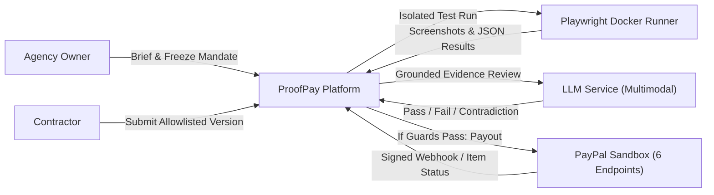

# ProofPay

> **ProofPay compiles the review queue between 'work submitted' and 'payment released' into executable acceptance checks — and pays only when evidence passes.**

Targeted for the **PayPal AI Hackathon 2026**.

---

## 🎯 What is ProofPay?

ProofPay eliminates software agency delivery review bottlenecks by compiling natural language briefs into automated acceptance test suites. When freelance contractors submit work, an isolated runner executes the test suite, and a multimodal LLM compares the contractor's claim against actual execution evidence and screenshot pixels. When all checks pass and release guards verify, payment is automatically dispatched via the **PayPal Payouts API**.

### 🌟 Key Differentiators
1. **Acceptance-Check Compiler:** Translates agency briefs into bounded, executable test templates (`viewport_no_horizontal_overflow`, `cart_total_unchanged`, `keyboard_checkout_reachable`).
2. **Grounded AI Reviewer:** Compares delivery claims against test execution outputs and screenshot pixels, surfacing precise contradictions (e.g. contractor claims mobile fix, but runner observes 480px horizontal overflow at 320px viewport).
3. **Strict PayPal Security Boundary:** AI models and test runners have zero access to financial credentials. The backend payment executor alone calls PayPal sandbox APIs across strictly 6 allowed endpoints.
4. **Idempotent Reconciliation:** One financial obligation per milestone across all mandate revisions, preventing duplicate payouts across retries and replayed events.

---

## 🏗️ Architecture



### Tech Stack
- **Frontend:** React, TypeScript, Vite, Tailwind CSS, AG Grid
- **Backend API:** FastAPI, SQLAlchemy (asyncpg / aiosqlite), Pydantic v2
- **Database:** PostgreSQL 16 (Relational schema, Outbox pattern, JSONB evidence)
- **Runner:** Isolated Playwright container with Chromium
- **Payment Rail:** PayPal Payouts REST API (Sandbox mode strictly enforced)
- **Deployment:** Docker Compose (local) / Render (hosted)

---

## 🚀 Quickstart

### Prerequisites
- Docker & Docker Compose
- *or* Python 3.11+ and Node.js 20+

### Option A: Run with Docker Compose (Recommended)
```bash
docker compose up --build
```
- Frontend UI: `http://localhost:3000`
- Backend API Docs: `http://localhost:8000/docs`
- Checkout Fixture: `http://localhost:8080`

### Option B: Run Locally
1. **Backend:**
   ```bash
   cd backend
   pip install -r requirements.txt
   python seed.py
   uvicorn backend.app.main:app --host 0.0.0.0 --port 8000 --reload
   ```
2. **Fixture:**
   ```bash
   cd fixture
   pip install -r requirements.txt
   uvicorn app:app --host 0.0.0.0 --port 8080
   ```
3. **Frontend:**
   ```bash
   cd frontend
   npm install
   npm run dev
   ```

---

## 🎬 175-Second Canonical Demo Arc (D01–D12)

1. **D01 (0–10s):** Agency owner inspects Work Queue with pending deliveries and hold states.
2. **D02–D03 (10–42s):** Agency owner enters responsive CSS brief; AI compiles 3 distinct checks (`C01`, `C02`, `C03`).
3. **D04 (42–53s):** Owner reviews and freezes immutable mandate with conditional payment authority ($75 USD).
4. **D05–D06 (53–89s) [Core Contradiction]:** Contractor submits broken version claiming "Mobile checkout fixed". Runner screenshot proves horizontal overflow at 320px. AI cites contradiction and holds payment.
5. **D07–D08 (89–125s):** Contractor resubmits corrected artifact. All 3 tests pass; AI reviewer confirms clean evidence.
6. **D09–D10 (125–161s):** Backend executor dispatches PayPal sandbox payout. Reconciles item `SUCCESS` and generates linked audit receipt.
7. **D11 (161–169s):** Replaying delivery resolves to existing attempt—zero duplicate payment.
8. **D12 (169–175s):** Contractor and agency owner views confirm identical financial settlement.

---

## 📜 License
MIT License. See [LICENSE](LICENSE) for details.
